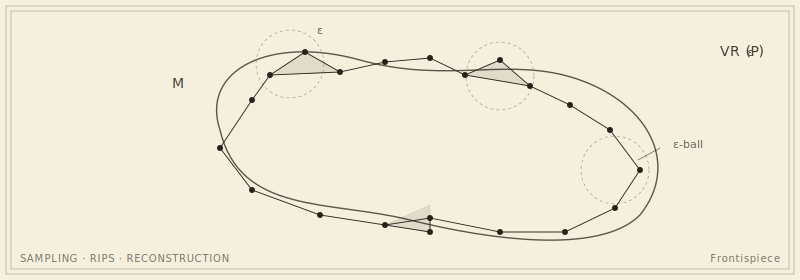

```{=html}
<header class="masthead page">
  <div class="kicker">Sushovan Majhi</div>
  <div class="pub-title">Research</div>
  <div class="edition">
    <span>Applied Topology &middot; Computational Geometry &middot; TDA</span>
    <span>Seven active projects</span>
    <span>Updated MMXXVI</span>
  </div>
</header>

<figure class="plate-spread">
  
  <figcaption><b>The reconstruction problem in one image</b>&mdash;a manifold <em>M</em>, a finite sample <em>P</em>, the &epsilon;-balls around it, and the Vietoris&ndash;Rips complex VR<sub>&epsilon;</sub>(P) that the topologist hopes will recover the shape of <em>M</em>.</figcaption>
</figure>

<div class="lede">
  <div class="pull-quote">
    &ldquo;The theorems decide when, and how faithfully, a finite sample remembers the manifold it was drawn from. The data is what we ask the question with.&rdquo;
  </div>
  <p>Two halves of the mathematical foundations of data science, with topology as the lens. On the theoretical side, theorems: when a finite sample remembers the manifold it was drawn from, when a Vietoris&ndash;Rips complex is homotopy-equivalent to the ground truth, when the Gromov&ndash;Hausdorff distance between two metric spaces is even computable. On the applied side, the disreputable data&mdash;finance, climate, biology, fluid mechanics&mdash;that wanted to know in the first place. The two halves keep each other honest, and, on bad days, mutually embarrassed.</p>
  <p>The recurring scaffolding of a result is austere: <em>under sampling condition X and parameter range Y, the constructed complex is homotopy-equivalent (or quasi-isometric, or close in the Gromov&ndash;Hausdorff distance) to the ground truth.</em> The work is in finding X and Y at once weak enough to hold in practice and strong enough to be useful. The proofs, when they come, tend to be apparently simple in retrospect&mdash;which is a polite way of saying they took a long time.</p>
  <p>What is constant across the work: a discomfort with descriptors that classify well but explain nothing, and a corresponding insistence that any pipeline used in earnest should come with a written guarantee of when it can be trusted, and when it cannot.</p>
</div>
```

## On the theoretical side

```{=html}
<div class="section-byline">
  <span>Filed under <em>Theory</em></span>
  <span>Algebraic topology &middot; metric geometry &middot; computational geometry</span>
</div>
<p class="section-kicker">From point clouds to homotopy equivalence, by way of finite samples.</p>
```

Provable methods for shape, graph, and manifold reconstruction. The objects of study are simplicial complexes built from finite samples&mdash;Vietoris&ndash;Rips, &Ccaron;ech, alpha&mdash;and the questions, as the frontispiece insists, are about *when* and *how faithfully* such complexes recover the topology and geometry of an unknown ground truth. The tools are inherited from algebraic topology, metric geometry, and computational geometry; all three considerably older than the data they have lately been asked to analyse.

The current open questions in the programme: closed-form bounds for adaptive-landmark constructions; stability of the Euler characteristic surface under noise; the Gromov&ndash;Hausdorff distance, in cases where it can be computed at all, between point clouds drawn from manifolds of different intrinsic dimension.

## On the applied side

```{=html}
<div class="section-byline">
  <span>Filed under <em>Application</em></span>
  <span>Finance &middot; climate &middot; fluid mechanics &middot; biology</span>
</div>
<p class="section-kicker">Where the data is high-dimensional but the regime is not.</p>
```

Where the data is unrepentantly high-dimensional but suspected, often correctly, of living on something simpler. Recent collaborations have hunted monsoon onsets, the topology of the polar vortex, two-phase flow regimes, and the moods of the stock market.

A working assumption: every applied problem starts with a domain expert pointing at a dataset and asking, *is there structure in here?* The topologist's contribution is to make that question precise enough to admit a theorem, and the descriptor (a persistence diagram, an Euler characteristic surface, a Reeb graph) general enough to be plugged into a downstream classifier without further apology.

## Active projects

```{=html}
<div class="section-byline">
  <span>Filed under <em>Open Problems</em></span>
  <span>Click a card for the long-form excuse for the title</span>
</div>
<p class="section-kicker">Seven open questions, in summary.</p>
```

Seven projects, each a corner of the broader programme. Click a card for collaborators, papers, and the longer description.

:::{#projects}
:::

## Publications and the rest of the file

```{=html}
<p class="section-kicker">Eleven preprints, ten journal papers, seven proceedings, one thesis.</p>
```

```{=html}
<aside class="colophon" style="margin-top: 2rem;">
  <span class="monogram">&#10086;</span>
  <p>The full account &mdash; eleven preprints, ten journal papers, seven conference proceedings, and the Ph.D. thesis &mdash; lives on the <a href="publications/">publications page</a>. Anything missing or in error will be corrected by post: <a href="mailto:s.majhi@gwu.edu">s.majhi@gwu.edu</a>.</p>
</aside>
```
