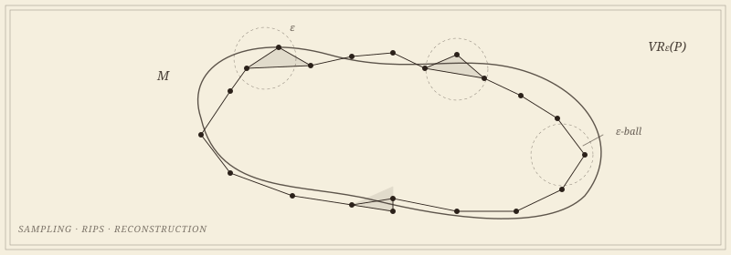

```{=html}
<header class="masthead page">
  <div class="kicker">Sushovan Majhi</div>
  <div class="pub-title">Research</div>
  <div class="edition">
    <span>Applied Topology &middot; Computational Geometry &middot; Mathematical Foundations of ML</span>
    <span>Ten active projects &middot; three movements</span>
    <span>Updated MMXXVI</span>
  </div>
</header>

<figure class="plate-spread">
  
  <figcaption><b>The reconstruction problem in one image</b>&mdash;a manifold <em>M</em>, a finite sample <em>P</em>, the &epsilon;-balls around it, and the Vietoris&ndash;Rips complex VR<sub>&epsilon;</sub>(P) that the topologist hopes will recover the shape of <em>M</em>.</figcaption>
</figure>

<div class="lede">
  <div class="pull-quote">
    &ldquo;The theorems decide when, and how faithfully, a finite sample remembers the manifold it was drawn from. The data is what we ask the question with.&rdquo;
  </div>
  <p>One program in three movements, with topology as the lens. First, the theorems: when a finite sample remembers the shape it was drawn from, when a Vietoris&ndash;Rips complex is homotopy-equivalent to the ground truth, when the Gromov&ndash;Hausdorff distance between two metric spaces is even computable. Second, the guarantees: what a topological descriptor is <em>forbidden</em> to lose once it is handed to a classifier or read off a neural network, and when two populations of diagrams can honestly be said to differ. Third, the data&mdash;finance, climate, fluid mechanics, ecology, geophysics&mdash;that asked the question in the first place. Euler calculus, the humblest invariant in the subject, runs through all three. The movements keep each other honest, and, on bad days, mutually embarrassed.</p>
  <p>The recurring scaffolding of a result is austere: <em>under sampling condition X and parameter range Y, the constructed complex is homotopy-equivalent (or quasi-isometric, or close in the Gromov&ndash;Hausdorff distance) to the ground truth.</em> The work is in finding X and Y at once weak enough to hold in practice and strong enough to be useful. The proofs, when they come, tend to be apparently simple in retrospect&mdash;which is a polite way of saying they took a long time.</p>
  <p>What is constant across the work: a discomfort with descriptors that classify well but explain nothing, and a corresponding insistence that any pipeline used in earnest should come with a written guarantee of when it can be trusted, and when it cannot.</p>
</div>
```

## First movement: the theorems

```{=html}
<div class="section-byline">
  <span>Filed under <em>Theory</em></span>
  <span>Algebraic topology &middot; metric geometry &middot; computational geometry</span>
</div>
<p class="section-kicker">From point clouds to homotopy equivalence, by way of finite samples.</p>
```

Provable methods for [shape, graph, and manifold reconstruction](projects/shape-recon.html), and for [comparing](projects/gh.html) the [shapes](projects/graph-distance.html) once reconstructed. The objects of study are simplicial complexes built from finite samples&mdash;Vietoris&ndash;Rips, &Ccaron;ech, alpha&mdash;and the questions, as the frontispiece insists, are about *when* and *how faithfully* such complexes recover the topology and geometry of an unknown ground truth. The tools are inherited from algebraic topology, metric geometry, and computational geometry&mdash;all three considerably older than the data they have lately been asked to analyze.

The current open questions: a lower bound for the Gromov&ndash;Hausdorff distance to a manifold with boundary, where the closed-manifold argument breaks at the collar; the dimension at which approximating the Gromov&ndash;Hausdorff distance becomes hard, now that the plane is known to admit a constant factor; graph reconstruction by Vietoris&ndash;Rips shadows in every ambient dimension; and an intrinsic, Whitney-type characterization of the metric spaces that are close to metric graphs.

## Second movement: the guarantees

```{=html}
<div class="section-byline">
  <span>Filed under <em>Learning</em></span>
  <span>Certification &middot; statistics &middot; neural networks &middot; Euler calculus</span>
</div>
<p class="section-kicker">A bound in both directions, or no certificate at all.</p>
```

The largest of the three movements, and the one growing fastest. Its premise: a learning pipeline used in earnest should come with a written guarantee, and topology is unusually good at supplying one. It runs in four strands.

- **[Certified kernels.](projects/kernels.html)** Every vectorization of a persistence diagram in the literature carries a bound in one direction, guaranteeing that nearby diagrams stay near; almost none forbids distinct diagrams from collapsing together. Supplying that second bound&mdash;in closed form, without training&mdash;is what makes a per-prediction certificate possible, and the landmark kernels PLACE and PALACE do it; a multiparameter successor carries the bound to multiparameter persistence.
- **[Statistics, and *Akriti*.](projects/statistics.html)** With a statistician colleague: PLACE gave the representation, PALACE the adaptive kernel, and a minimax inference theory the tests that make both usable on populations of diagrams&mdash;whether two populations differ, and where in the birth&ndash;death plane. The methods ship in *Akriti*, an open-source Python library built with a student team.
- **[Topology inside neural networks.](projects/networks.html)** A sentence like <em>layer &ell;+1 is more disentangled than layer &ell;</em> has long been an eyeball judgment with no null; the intersection Euler characteristic profile turns it into an exact test. The same discipline audits memorization in generative models and locates, layer by layer, where a classifier absorbs noisy labels.
- **[Euler calculus.](projects/euler.html)** The Euler characteristic surface and its mixup profile, the cheapest invariants in the subject, carry the program to time series, where a transition is a coordinate rather than a label.

The current open questions: certification beyond a single witnessing coordinate, where every landmark embedding currently stops; multiparameter persistence with a lower bound, not only an upper one; what a trained network has memorized, stated as a test rather than a score; and the stability of Euler signatures under projection from three dimensions to two, which is what a camera does to a flow.

## Third movement: the data that asked

```{=html}
<div class="section-byline">
  <span>Filed under <em>Application</em></span>
  <span>Finance &middot; climate &middot; fluid mechanics &middot; ecology &middot; geophysics</span>
</div>
<p class="section-kicker">A domain expert, a dataset, and the question of whether there is structure in it.</p>
```

Where the data is unrepentantly high-dimensional but suspected, often correctly, of living on something simpler. Recent collaborations have hunted monsoon onsets, the topology of the polar vortex, the geometry of a subduction zone from earthquake hypocenters, thresholds in plant communities across a Superfund contamination gradient, and the moods of the stock market. The longest-running is in a two-phase flow laboratory at Montana Tech, where the Euler characteristic has become an instrument: it corrected a classical flow-regime map, and read frame by frame from video it gives a tracking-free activity channel, calibrated against high-speed conductance probes, that measures how strongly the large gas structures in a pipe fluctuate.

A working assumption: every applied problem starts with a domain expert pointing at a dataset and asking, *is there structure in here?* The topologist's contribution is to make that question precise enough to admit a theorem, and the descriptor (a persistence diagram, an Euler characteristic surface, a Reeb graph) general enough to be plugged into a downstream classifier without further apology.

## Active projects

```{=html}
<div class="section-byline">
  <span>Filed under <em>Projects</em></span>
  <span>Theorems, then guarantees, then data</span>
</div>
<p class="section-kicker">Ten projects across the three movements.</p>
```

Each project is a corner of the broader program. Click a card for collaborators, papers, and the longer description.

:::{#projects}
:::

## Publications and the rest of the file

```{=html}
<p class="section-kicker">The full account.</p>
```

```{=html}
<aside class="colophon" style="margin-top: 2rem;">
  <span class="monogram">&#10086;</span>
  <p>The full account&mdash;ten preprints, thirteen journal papers, four refereed proceedings, eight workshop contributions, and the Ph.D. thesis&mdash;lives on the <a href="publications/">publications page</a>. Anything missing or in error will be corrected by post: <a href="mailto:s.majhi@gwu.edu">s.majhi@gwu.edu</a>.</p>
</aside>
```
