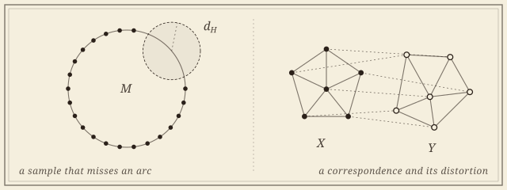

```{=html}
<header class="masthead page">
  <div class="kicker">Research &middot; Plate II</div>
  <div class="pub-title">Comparing Shapes</div>
  <div class="edition">
    <span>Gromov&ndash;Hausdorff &middot; edit &middot; transport &middot; Fr&eacute;chet</span>
    <span>Thirteen collaborators</span>
    <span>Updated MMXXVI</span>
  </div>
</header>

<figure class="plate-spread">
  
  <figcaption><b>The two questions</b>&mdash;how far a sample can sit from its space in the Gromov&ndash;Hausdorff sense when it visibly misses part of it in the Hausdorff sense; and how to compute <em>d<sub>GH</sub></em>(<em>X</em>, <em>Y</em>), the least distortion of any correspondence between two shapes.</figcaption>
</figure>

<div class="lede">
  <div class="pull-quote">
    &ldquo;Every theorem about a finite sample remembering its space passes, sooner or later, through a distance between shapes. The work is in making that distance computable and honest.&rdquo;
  </div>
  <p>Reconstruction asks whether a sample remembers its shape; comparison asks how far apart two shapes are. The Gromov&ndash;Hausdorff distance <em>d<sub>GH</sub></em> measures how far two abstract metric spaces are from being isometric. It is foundational to topological data analysis and notoriously hard to compute; the work here produces lower bounds in terms of the better-behaved Hausdorff distance, and approximation algorithms with stated factors.</p>
  <p>For shapes that are embedded graphs&mdash;road maps, molecular graphs, the bonds of a crystal, vascular and neuronal trees&mdash;the question has a sharper practical edge, and the distances proposed for it pull in different directions: some are true metrics but NP-hard, some are fast but blind to the geometry, some are stable and some are not. The recurring strategy on both fronts: replace an intractable optimization with a tractable surrogate, and prove that the surrogate cannot lie by more than a stated factor.</p>
</div>
```

## Hausdorff versus Gromov&ndash;Hausdorff

```{=html}
<div class="section-byline">
  <span>Filed under <em>Theory</em></span>
  <span>Lower bounds &middot; manifolds &middot; metric graphs</span>
</div>
<p class="section-kicker">When a sample that misses part of a space cannot be close to it intrinsically.</p>
```

For a subset $X$ of a space $M$, the Gromov&ndash;Hausdorff distance never exceeds the Hausdorff distance. The question is the reverse: when does missing part of $M$ force $X$ to be intrinsically far from it? The answers are lower bounds for $d_{GH}$ in terms of $d_H$, with constants that depend on the geometry of $M$.

1. [**Lower Bounding the Gromov&ndash;Hausdorff Distance: Manifolds with Boundary.** With Henry Adams, Nikola Sadovek, &Zcaron;iga Virk, and Nicol&ograve; Zava. In preparation.\
   [Extending the lower bounds from closed manifolds to manifolds with boundary.]{.synopsis}]{.in-prep}
1. **Lower Bounding the Gromov&ndash;Hausdorff Distance in Metric Graphs.** With Henry Adams, Fedor Manin, Nicol&ograve; Zava, and &Zcaron;iga Virk. SoCG&nbsp;2026. [arXiv](https://arxiv.org/abs/2411.09182).
1. **Hausdorff vs Gromov&ndash;Hausdorff Distances.** With Henry Adams, Florian Frick, and Nicholas McBride. *Discrete &amp; Computational Geometry*, 2025. [DOI](https://doi.org/10.1007/s00454-025-00722-9) &middot; [arXiv](https://arxiv.org/abs/2309.16648).

## Computing the distance

```{=html}
<div class="section-byline">
  <span>Filed under <em>Theory &middot; Algorithms</em></span>
  <span>Approximation &middot; hardness &middot; Euclidean point sets</span>
</div>
<p class="section-kicker">Polynomial time, a constant factor, and where both stop.</p>
```

Computing $d_{GH}$ is NP-hard in general, and approximating it well is hard even for metric trees. For Euclidean point sets the geometry helps: this line gives the plane a constant factor.

1. **A Constant-Factor Approximation of the Gromov&ndash;Hausdorff Distance in the Plane.** Preprint, 2026. [arXiv](https://arxiv.org/abs/2606.17051).
1. **Approximating Gromov&ndash;Hausdorff Distance in Euclidean Space.** With Jeffrey Vitter and Carola Wenk. *Computational Geometry: Theory and Applications*, 2024. [DOI](https://doi.org/10.1016/j.comgeo.2023.102034) &middot; [arXiv](https://arxiv.org/abs/1912.13008).

An open question I am thinking about: in which dimension does the difficulty return? Whether the planar argument extends to higher dimensions, and where approximating $d_{GH}$ for Euclidean point sets becomes hard, and within what factor, is not yet known.

## Geometric graphs

```{=html}
<div class="section-byline">
  <span>Filed under <em>Theory</em></span>
  <span>Edit &middot; transport &middot; Fr&eacute;chet &middot; with Carola Wenk and Vitaliy Kurlin</span>
</div>
<p class="section-kicker">An invariant says whether; a distance says how different, and with what guarantees.</p>
```

The work is active, as a weekly working group with Carola Wenk and Vitaliy Kurlin, and it sits on the distance side of the question. Its first deliverable is a survey chapter that organizes the edit-, transport-, and correspondence-based distances by their metric axioms, complexity, and stability, and relates them to one another through bounds and reductions on the same pair of graphs. Around it: faster transport-based comparisons, for geometric graphs and for the distributional invariants that describe them, using modern approximate optimal transport with a stated error bound; the metric geometry of the space of embedded graphs itself; and applications, beginning with road networks, where two reconstructions of the same city never agree and the question is by how much. A student thread asks the learning version: when a graph neural network can be trained to match geometric graphs, and what it certifies when it does.

```{=html}
<figure class="plate-spread">
  
  <figcaption><b>Two ways to price a matching</b>&mdash;by the edits and transport needed to carry one embedded graph onto another, or by the shortest leash that lets a walk along one keep pace with a walk along the other.</figcaption>
</figure>
```

1. [**Distances Between Geometric Graphs: A Survey of Metric and Computational Properties.** An invited chapter for the AMS *Contemporary Mathematics* volume on Geometric Data Science. In preparation.\
   [Edit-based, transport-based, and correspondence-based distances compared on metric axioms, complexity, and stability, with the open problems collected.]{.synopsis}]{.in-prep}
1. **Distance Measures for Geometric Graphs.** With Carola Wenk. *Computational Geometry: Theory and Applications*, 2024. [DOI](https://doi.org/10.1016/j.comgeo.2023.102056) &middot; [arXiv](https://arxiv.org/abs/2209.12869).\
   [The geometric edit and geometric graph distances, their metric properties, and the NP-hardness of computing them.]{.synopsis}
1. **Graph Mover's Distance: An Efficiently Computable Distance Measure for Geometric Graphs.** *Canadian Conference on Computational Geometry* (CCCG), 2023. [DBLP](https://dblp.org/rec/conf/cccg/Majhi23.html) &middot; [arXiv](https://arxiv.org/abs/2306.02133).\
   [A transport-based alternative, computable in polynomial time.]{.synopsis}
1. **Metric and Path-Connectedness Properties of the Fr&eacute;chet Distance for Paths and Graphs.** With Erin Chambers, Brittany Fasy, Benjamin Holmgren, and Carola Wenk. *Canadian Conference on Computational Geometry* (CCCG), 2023. [DBLP](https://dblp.org/db/conf/cccg/cccg2023.html) &middot; [arXiv](https://arxiv.org/abs/2308.00900).

```{=html}
<div class="roster-head">Workshop contributions</div>
```

::: {.workshop-list}
- *Path-Connectivity of Fr&eacute;chet Spaces of Graphs.* With Erin Chambers, Brittany Fasy, Benjamin Holmgren, and Carola Wenk. Computational Geometry: Young Researchers Forum, 2022.
- *Distance Measures for Geometric Graphs.* With Carola Wenk. Fall Workshop on Computational Geometry, 2022.
:::

## Collaborators

```{=html}
<div class="section-byline">
  <span>Filed under <em>Co-authors</em></span>
  <span>Six present, seven past</span>
</div>
<p class="section-kicker">Topologists, geometers, and computer scientists.</p>
```

```{=html}
<div class="roster-head">Present</div>
```

- [Henry Adams]{.collab}, *University of Florida*
- [&Zcaron;iga Virk]{.collab}, *University of Ljubljana*
- [Nicol&ograve; Zava]{.collab}, *IST Austria*
- [Nikola Sadovek]{.collab}, *Carnegie Mellon University*
- [Carola Wenk]{.collab}, *Tulane University*
- [Vitaliy Kurlin]{.collab}, *University of Liverpool*

```{=html}
<div class="roster-head">Past</div>
```

- [Fedor Manin]{.collab}, *University of Toronto*
- [Florian Frick]{.collab}, *Carnegie Mellon University*
- [Nicholas McBride]{.collab}, *UC Santa Cruz*
- [Jeffrey Vitter]{.collab}, *Tulane University*
- [Erin Chambers]{.collab}, *University of Notre Dame*
- [Brittany Fasy]{.collab}, *Montana State University*
- [Benjamin Holmgren]{.collab}

```{=html}
<aside class="colophon" style="margin-top: 3rem;">
  <span class="monogram">&#10086;</span>
  <p>Back to the <a href="../">research overview</a>, or read about <a href="shape-recon.html">shape reconstruction</a>, where these distances do the bookkeeping.</p>
</aside>
```
