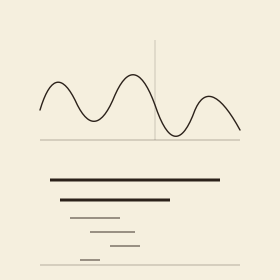

```{=html}
<header class="masthead page">
  <div class="kicker">Research &middot; Plate V</div>
  <div class="pub-title">TDA for Time Series &amp; Dynamics</div>
  <div class="edition">
    <span>Climate &middot; statistical finance &middot; fluid mechanics</span>
    <span>Many collaborators</span>
    <span>Updated MMXXVI</span>
  </div>
</header>

<figure class="plate-spread">
  
  <figcaption><b>A non-linear time series</b>&mdash;and its persistence barcode: the bars are the topological features that the sliding window detects in phase space.</figcaption>
</figure>

<div class="lede">
  <div class="pull-quote">
    &ldquo;Regimes do not announce themselves. The topology, sometimes, does.&rdquo;
  </div>
  <p>Topological data analysis is unusually well-suited to non-linear time series and dynamical systems. A sliding window in phase space carries the topology of an underlying attractor; that topology often changes sharply at the very moments&mdash;regime transitions, crashes, onsets, withdrawals&mdash;that domain scientists most want to detect, and that ordinary descriptors most often miss. The work in this project carries persistence diagrams, Euler characteristic surfaces, and complex-network constructions into climate science, statistical finance, and fluid mechanics.</p>
  <p>What unites the three application domains is the topologist's working assumption: <em>the data is high-dimensional, but the regime is not</em>. Find the regime, find the change-point, find the descriptor that survives the noise. The papers below report on attempts at all three, in collaboration with NIT Sikkim, Montana Tech, Oxford climate, and several others.</p>
</div>
```

## Active threads

```{=html}
<div class="section-byline">
  <span>Filed under <em>Application</em></span>
  <span>Three domains</span>
</div>
<p class="section-kicker">Climate, finance, fluid mechanics.</p>
```

- **Climate.** Predicting the onset and withdrawal of the [Indian monsoon](https://arxiv.org/abs/2504.01022) from historical wind data; topological signatures of the [polar vortex](https://arxiv.org/abs/2503.20743) and Montana weather.
- **Statistical finance.** [Identifying extreme events](https://arxiv.org/abs/2405.16052) in the stock market; [complex-network analysis of cryptocurrency crashes](https://arxiv.org/abs/2405.05642); causality of COVID-19-induced market crashes.
- **Fluid mechanics.** Topological characterization of [churn flow](https://arxiv.org/abs/2604.06167) and unsupervised correction to flow-regime maps in vertical pipes.

## Collaborators

```{=html}
<div class="section-byline">
  <span>Filed under <em>Co-authors</em></span>
  <span>Multiple institutions, three domains</span>
</div>
<p class="section-kicker">Multiple institutions, three application domains.</p>
```

- Md.&nbsp;Nurujjaman, NIT Sikkim
- Atish Mitra, Montana Technological University
- Joshua Dorrington, Kristian Strommen, Maria S&aacute;nchez Muniz&mdash;climate
- Anish Rai, Buddha Nath Sharma, Salam Rabindrajit Luwang&mdash;finance
- Brady Koenig, Burt Todd&mdash;fluid mechanics
- Chittaranjan Hens, Kanish Debnath, Kundan Mukhia

## Publications

::: {#refs}
:::

```{=html}
<aside class="colophon" style="margin-top: 3rem;">
  <span class="monogram">&#10086;</span>
  <p>Back to the <a href="../">research overview</a>, or read about the closely related work on <a href="euler.html">Euler characteristic methods</a>.</p>
</aside>
```
