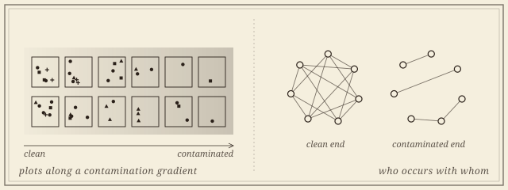

```{=html}
<header class="masthead page">
  <div class="kicker">Research &middot; Plate VII</div>
  <div class="pub-title">Community Thresholds in Restoration Ecology</div>
  <div class="edition">
    <span>Co-occurrence structure &middot; contamination gradients &middot; thresholds</span>
    <span>Ten years of Superfund monitoring</span>
    <span>Updated MMXXVI</span>
  </div>
</header>

<figure class="plate-spread">
  
  <figcaption><b>Two ways to read a gradient</b>&mdash;species counted plot by plot, from clean ground to contaminated; and the structure of who occurs with whom, which can change even when the counts do not.</figcaption>
</figure>

<div class="lede">
  <div class="pull-quote">
    &ldquo;A community can reorganize while every individual abundance profile stays exactly where it was. No method that aggregates taxon-level change can see that happen.&rdquo;
  </div>
  <p>Whether a degraded plant community responds to contamination <em>smoothly</em> or at <em>thresholds</em> decides how reclamation targets get set, and it is contested. The standard detection tools&mdash;threshold indicator taxa analysis, gradient forest, breakpoint regression on ordination axes&mdash;all build a community threshold by aggregating change in individual taxon abundances.</p>
  <p>There is a mode of reorganization none of them is built to see: taxa rearrange <em>which other taxa they occur with</em> while every abundance profile stays put. This project summarizes the shape of a community's co-occurrence structure by an Euler characteristic, tracks it along the gradient in sliding windows of plots, and locates a threshold where that summary changes most&mdash;and, because the statistic is cheap, its significance can be read against a permutation null rather than asserted.</p>
  <p>This is a collaboration with Robert Pal's restoration-ecology laboratory at Montana Technological University, which holds ten years of vegetation monitoring across the Butte Hill Superfund site. The data are small, heterogeneous and field-collected, which is the interesting constraint: a descriptor that needs thousands of clean samples is of no use here.</p>
</div>
```

## Papers

```{=html}
<div class="section-byline">
  <span>Filed under <em>Application &middot; Ecology</em></span>
  <span>Superfund &middot; field data</span>
</div>
<p class="section-kicker">Smoothly, or at thresholds.</p>
```

1. [**Locating Community Thresholds Along Contamination Gradients with Euler Characteristic Surfaces.** With Robert Pal, Atish Mitra, and Ying Sun. Written to stand on simulation and public data, with the analysis of the Butte Hill monitoring record specified in advance. In preparation.]{.in-prep}

## Collaborators

```{=html}
<div class="section-byline">
  <span>Filed under <em>Co-authors</em></span>
  <span>Three present</span>
</div>
<p class="section-kicker">Field ecology and topology, on the same ground.</p>
```

```{=html}
<div class="roster-head">Present</div>
```

- [Robert Pal]{.collab}, *Restoration Ecology, Montana Technological University*, who leads the laboratory
- [Atish Mitra]{.collab}, *Montana Technological University*
- [Ying Sun]{.collab}, *Rare Flora, Inc.*

```{=html}
<aside class="colophon" style="margin-top: 3rem;">
  <span class="monogram">&#10086;</span>
  <p>Back to the <a href="../">research overview</a>, or read about <a href="euler.html">topology in time series and dynamics</a>, where the same invariant is at work, and its other field application, <a href="mtvfl.html">multiphase flow at the Montana Tech loop</a>.</p>
</aside>
```
