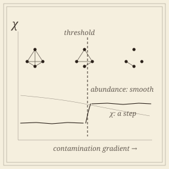

```{=html}
<header class="masthead page">
  <div class="kicker">Research &middot; Plate VIII</div>
  <div class="pub-title">Community Thresholds in Restoration Ecology</div>
  <div class="edition">
    <span>Co-occurrence structure &middot; contamination gradients &middot; thresholds</span>
    <span>Ten years of Superfund monitoring</span>
    <span>Updated MMXXVI</span>
  </div>
</header>

<figure class="plate-spread">
  
  <figcaption><b>Two ways to read a gradient</b>&mdash;abundance declines smoothly; the co-occurrence structure holds and then gives way. Only the second has a threshold in it.</figcaption>
</figure>

<div class="lede">
  <div class="pull-quote">
    &ldquo;A community can reorganize while every individual abundance profile stays exactly where it was. No method that aggregates taxon-level change can see that happen.&rdquo;
  </div>
  <p>Whether a degraded plant community responds to contamination <em>smoothly</em> or at <em>thresholds</em> decides how reclamation targets get set, and it is contested. The standard detection tools&mdash;threshold indicator taxa analysis, gradient forest, breakpoint regression on ordination axes&mdash;all build a community threshold by aggregating change in individual taxon abundances.</p>
  <p>There is a mode of reorganization none of them is built to see: taxa rearrange <em>which other taxa they occur with</em> while every abundance profile stays put. This project summarizes the shape of a community's co-occurrence structure by the Euler characteristic of a filtered clique complex, evaluated at fixed connectance so the summary carries structural rather than merely density information, and tracks it along the gradient in sliding windows of plots. A threshold is then located by the split that maximizes a difference in that summary&mdash;and, because the statistic is cheap, its significance can be read against a permutation null rather than asserted.</p>
  <p>This is a collaboration with <strong>Robert Pal</strong>'s restoration-ecology laboratory at Montana Technological University, which holds ten years of vegetation monitoring across the Butte Hill Superfund site. The data are small, heterogeneous and field-collected, which is the interesting constraint: a descriptor that needs thousands of clean samples is of no use here.</p>
</div>
```

## Status

```{=html}
<div class="section-byline">
  <span>Filed under <em>In progress</em></span>
  <span>First preprint expected</span>
</div>
<p class="section-kicker">Methods spine complete; the Butte Hill analysis is pre-registered.</p>
```

```{=html}
<p>The manuscript&mdash;<em>Locating community thresholds along contamination gradients with Euler characteristic surfaces</em>, targeting <em>Methods in Ecology and Evolution</em>&mdash;is written to stand on simulation and public data, with the Butte Hill analysis specified in advance as a protocol that becomes a results section when the data inventory arrives. A preprint follows once the pending simulation numbers land. This page will carry the link.</p>
<p>One negative result is already worth recording: under a plain radius sweep, density dominates the Euler characteristic entirely, and any apparent structural signal is an artifact of edge count. The descriptor only separates communities when connectance is matched. That constraint is not a detail&mdash;it is the reason the construction is stated the way it is.</p>
```

## Collaborators

```{=html}
<div class="section-byline">
  <span>Filed under <em>Collaborators</em></span>
  <span>Ecology &amp; mathematics</span>
</div>
<p class="section-kicker">A field laboratory and a topologist.</p>
```

- **Robert Pal**, Restoration Ecology, Montana Technological University&mdash;*laboratory lead*
- Atish Mitra, Montana Technological University

```{=html}
<aside class="colophon" style="margin-top: 3rem;">
  <span class="monogram">&#10086;</span>
  <p>Back to the <a href="../">research overview</a>, or read about the descriptor this rests on&mdash;<a href="euler.html">Euler characteristic methods</a>&mdash;and its other field application, <a href="mtvfl.html">multiphase flow at the Montana Tech loop</a>.</p>
</aside>
```
