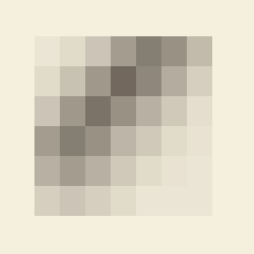

```{=html}
<header class="masthead page">
  <div class="kicker">Research &middot; Plate I</div>
  <div class="pub-title">Euler Characteristic Methods</div>
  <div class="edition">
    <span>Cumulative topology &middot; classification &middot; regime detection</span>
    <span>Three preprints under review</span>
    <span>Updated MMXXVI</span>
  </div>
</header>

<figure class="plate-spread">
  
  <figcaption><b>The Euler characteristic surface</b>&mdash;a 2D map &chi;(&epsilon;,&tau;), encoding topological summary across filtration scale and threshold.</figcaption>
</figure>

<div class="lede">
  <div class="pull-quote">
    &ldquo;The Euler characteristic is the simplest topological invariant&mdash;and, after enough integration, the most useful.&rdquo;
  </div>
  <p>The Euler characteristic is the modest invariant: an alternating sum of simplex counts that, written down, fits on a postcard. Computed across a filtration, however, it encodes considerably more structure than the postcard would suggest. Recent work uses <em>Euler characteristic profiles</em> and <em>Euler characteristic surfaces</em> as fast, interpretable descriptors for time-series classification, regime detection in chaotic dynamical systems, and unsupervised classification of two-phase flow regimes.</p>
  <p>The advantage of these descriptors over their persistence-based cousins is computational: the Euler characteristic is linear in simplex count and can be tracked through a filtration in a single pass. The cost is that the descriptor is not, in general, complete&mdash;different topologies can share an Euler characteristic surface. The work navigates that trade-off honestly.</p>
</div>
```

## Active threads

```{=html}
<div class="section-byline">
  <span>Filed under <em>Theory &middot; Application</em></span>
  <span>Three preprints, MMXXVI</span>
</div>
<p class="section-kicker">Three preprints, three application domains.</p>
```

- ***[Interpretable Classification of Time Series Using Euler Characteristic Surfaces](https://arxiv.org/abs/2603.15079)***&mdash;a fully interpretable pipeline for time-series classification, with Atish Mitra and the NIT Sikkim group; under review at *Nature Scientific Reports*.
- ***[Detecting Regime Transitions in Dynamical Systems via the Mixup Euler Characteristic Profile](https://arxiv.org/abs/2604.15262)***&mdash;a mixup-style ECP for regime change in chaotic systems, submitted to *Chaos*.
- ***[Topological Characterization of Churn Flow and Unsupervised Correction to the Wu Flow-Regime Map](https://arxiv.org/abs/2604.06167)***&mdash;ECS for two-phase flow classification in vertical pipes, submitted to *International Journal of Multiphase Flow*.

## Collaborators

```{=html}
<div class="section-byline">
  <span>Filed under <em>Co-authors</em></span>
  <span>Two institutions, several students</span>
</div>
<p class="section-kicker">Two institutions, several students.</p>
```

- Atish Mitra, Montana Technological University
- Md.&nbsp;Nurujjaman, NIT Sikkim
- Buddha Nath Sharma, Salam Rabindrajit Luwang&mdash;NIT Sikkim
- Brady Koenig, Abigail Stein, Burt Todd&mdash;Montana Tech
- Vishal Mandal, Santanu Nandi

```{=html}
<aside class="colophon" style="margin-top: 3rem;">
  <span class="monogram">&#10086;</span>
  <p>Back to the <a href="../">research overview</a>, or read about the closely related work on <a href="dynamics.html">TDA for time series &amp; dynamics</a>.</p>
</aside>
```
