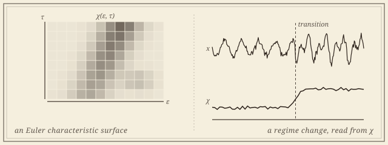
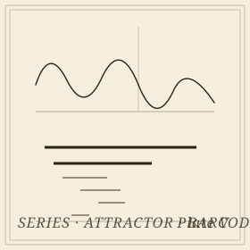

```{=html}
<header class="masthead page">
  <div class="kicker">Research &middot; Plate V</div>
  <div class="pub-title">Topology in Time Series &amp; Dynamics</div>
  <div class="edition">
    <span>Euler calculus &middot; regime detection &middot; climate &middot; markets</span>
    <span>With NIT Sikkim, Montana Tech, and Tsukuba</span>
    <span>Updated MMXXVI</span>
  </div>
</header>

<figure class="plate-spread">
  
  <figcaption><b>A surface and a signal</b>&mdash;the Euler characteristic tracked across scale and threshold, &chi;(&epsilon;, &tau;); and the same invariant read along a time series, where it jumps at the moment the regime changes.</figcaption>
</figure>

<div class="lede">
  <div class="pull-quote">
    &ldquo;Regimes do not announce themselves. The topology, sometimes, does.&rdquo;
  </div>
  <p>The Euler characteristic is the modest invariant: an alternating sum of simplex counts that, written down, fits on a postcard. Tracked across a filtration it encodes considerably more than the postcard suggests, and it costs a single pass&mdash;linear in the size of the complex, where persistence pays for a matrix reduction. The price is that it is not complete; different topologies can share it. The work here makes that trade honestly: <em>Euler characteristic surfaces</em> and <em>profiles</em> as fast, interpretable descriptors, with the Euler calculus and stability theory that say what they can be trusted to see.</p>
  <p>Time series and dynamical systems are where they earn their keep. A regime transition, a crash, a monsoon onset is often a change in the shape of the data before it is a change in its mean, and the working assumption throughout is the topologist's: <em>the data is high-dimensional, but the regime is not</em>. The Euler characteristic carries the foundations and the regime-detection work below; the work on markets uses persistence and complex networks, the older tools of the same trade.</p>
</div>
```

## Foundations

```{=html}
<div class="section-byline">
  <span>Filed under <em>Theory</em></span>
  <span>Euler calculus &middot; stability &middot; inference</span>
</div>
<p class="section-kicker">What the invariant measures, and when to believe it.</p>
```

The intersection Euler characteristic profile measures how two point clouds overlap: the Euler characteristic of the intersection of their ball unions, as a function of scale, from a single alpha-complex sweep. It is the instrument behind the [neural-network work](networks.html), and it needs its own theory.

1. [**Statistical Inference for Topological Interaction.** With Kazuhiro Kawamura, Atish Mitra, and Pramita Bagchi. In preparation.]{.in-prep}
1. **The Intersection Euler Characteristic Profile: Euler Calculus and Stability for Topological Interaction of Ball Unions.** With Kazuhiro Kawamura and Atish Mitra. Under review at the *Journal of Applied and Computational Topology*. [arXiv](https://arxiv.org/abs/2608.06180).

## Time series and regime detection

```{=html}
<div class="section-byline">
  <span>Filed under <em>Learning &middot; Dynamics</em></span>
  <span>Classification &middot; transitions &middot; climate</span>
</div>
<p class="section-kicker">A transition as a coordinate, not a label.</p>
```

1. **Detecting Regime Transitions in Dynamical Systems via the Mixup Euler Characteristic Profile.** With Atish Mitra, Santanu Nandi, Md. Nurujjaman, and Buddha Nath Sharma. Under review at *Chaos*. [arXiv](https://arxiv.org/abs/2604.15262).\
   [Applied to the onset of the Indian monsoon.]{.synopsis}
1. **Interpretable Classification of Time Series Using Euler Characteristic Surfaces.** With Buddha Nath Sharma, Vishal Mandal, Salam Rabindrajit Luwang, Md. Nurujjaman, and Atish Mitra. *Scientific Reports*, 2026. [DOI](https://doi.org/10.1038/s41598-026-64177-5) &middot; [arXiv](https://arxiv.org/abs/2603.15079).

```{=html}
<div class="roster-head">Workshop contributions</div>
```

::: {.workshop-list}
- *Topology of the Polar Vortex and Montana Weather.* With Joshua Dorrington, Atish Mitra, James Moukheiber, Demi Qin, Jacob Sriraman, and Kristian Strommen. ATMCS&nbsp;2025. [arXiv](https://arxiv.org/abs/2503.20743).
- *Detecting the Indian Monsoon Using Topological Data Analysis.* With Enrique Alvarado, Daniela Beckelhymer, Joshua Dorrington, Tung Lam, Jasmine Noory, Mar&iacute;a S&aacute;nchez Muniz, and Kristian Strommen. ATMCS&nbsp;2025. [arXiv](https://arxiv.org/abs/2504.01022).
:::

## Markets

```{=html}
<div class="section-byline">
  <span>Filed under <em>Application</em></span>
  <span>Crashes &middot; extreme events &middot; recovery</span>
</div>
<p class="section-kicker">The moods of the stock market, read topologically.</p>
```

```{=html}
<figure class="fig-right">
  
</figure>
```

A long collaboration with Md. Nurujjaman's group at NIT Sikkim carries persistence and network methods into statistical finance: which crashes are extreme, how a crash propagates across sectors and commodities, and why, after COVID-19, not every sector recovered along the same curve.

1. **Causality Analysis of COVID-19 Induced Crashes in Stock and Commodity Markets: A Topological Perspective.** With Buddha Nath Sharma, Anish Rai, Salam Rabindrajit Luwang, and Md. Nurujjaman. *International Journal of Modern Physics C*, 2025. [DOI](https://doi.org/10.1142/S0129183126500221) &middot; [arXiv](https://arxiv.org/abs/2502.14431).
1. **Complex Network Analysis of Cryptocurrency Market During Crashes.** With Kundan Mukhia, Anish Rai, Salam Rabindrajit Luwang, Md. Nurujjaman, and Chittaranjan Hens. *Physica A*, 2024. [DOI](https://doi.org/10.1016/j.physa.2024.130095) &middot; [arXiv](https://arxiv.org/abs/2405.05642).
1. **Identifying Extreme Events in the Stock Market: A Topological Data Analysis.** With Anish Rai, Buddha Nath Sharma, Salam Rabindrajit Luwang, and Md. Nurujjaman. *Chaos*, 2024. [DOI](https://doi.org/10.1063/5.0220424) &middot; [arXiv](https://arxiv.org/abs/2405.16052).
1. **A Sentiment-Based Modeling and Analysis of Stock Price During the COVID-19: U- and Swoosh-Shaped Recovery.** With Anish Rai, Ajit Mahata, Md. Nurujjaman, and Kanish Debnath. *Physica A*, 2022. [DOI](https://doi.org/10.1016/j.physa.2021.126810) &middot; [arXiv](https://arxiv.org/abs/2110.03986).

## Collaborators

```{=html}
<div class="section-byline">
  <span>Filed under <em>Co-authors</em></span>
  <span>Four present, and many past</span>
</div>
<p class="section-kicker">From Gangtok to Butte to Tsukuba.</p>
```

```{=html}
<div class="roster-head">Present</div>
```

- [Atish Mitra]{.collab}, *Montana Technological University*
- [Kazuhiro Kawamura]{.collab}, *University of Tsukuba*
- [Md. Nurujjaman]{.collab}, *National Institute of Technology Sikkim*
- [Pramita Bagchi]{.collab}, *The George Washington University*

```{=html}
<div class="roster-head">Past</div>
```

- [Buddha Nath Sharma]{.collab}, [Salam Rabindrajit Luwang]{.collab}, [Anish Rai]{.collab}, [Vishal Mandal]{.collab}, [Santanu Nandi]{.collab}
- [Kundan Mukhia]{.collab}, [Chittaranjan Hens]{.collab}, [Ajit Mahata]{.collab}, [Kanish Debnath]{.collab}
- [Joshua Dorrington]{.collab}, [Kristian Strommen]{.collab}, and the ATMCS climate teams

```{=html}
<aside class="colophon" style="margin-top: 3rem;">
  <span class="monogram">&#10086;</span>
  <p>Back to the <a href="../">research overview</a>, or read about <a href="mtvfl.html">the Montana Tech flow loop</a>, where the Euler characteristic became a measuring instrument.</p>
</aside>
```
