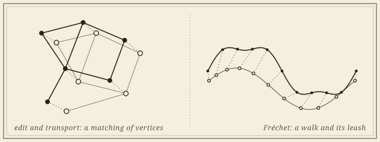

```{=html}
<header class="masthead page">
  <div class="kicker">Research &middot; Plate III</div>
  <div class="pub-title">Geometric Graph Distances</div>
  <div class="edition">
    <span>Road networks &middot; molecules &middot; embedded graphs</span>
    <span>With Carola Wenk and Vitaliy Kurlin</span>
    <span>Updated MMXXVI</span>
  </div>
</header>

<figure class="plate-spread">
  
  <figcaption><b>Two ways to price a matching</b>&mdash;by the edits and transport needed to carry one embedded graph onto another, or by the shortest leash that lets a walk along one keep pace with a walk along the other.</figcaption>
</figure>

<div class="lede">
  <div class="pull-quote">
    &ldquo;Two road maps of the same city never agree. The question is how to say by how much, in a way a computer can check and a theorem can use.&rdquo;
  </div>
  <p>A geometric graph is a combinatorial graph with a straight-line embedding in Euclidean space, and it carries both kinds of structure at once: road maps, molecular graphs, the bonds of a crystal, vascular and neuronal trees. An isometry invariant answers whether two of them are the same up to rigid motion. A distance answers the harder practical question&mdash;<em>how</em> different, and with what guarantees&mdash;and the distances proposed for it pull in different directions: some are true metrics but NP-hard, some are fast but blind to the geometry, some are stable and some are not.</p>
  <p>The project is active, as a weekly working group with Carola Wenk and Vitaliy Kurlin, and it works on the distance side. Its first deliverable is a survey chapter that organizes the edit-, transport-, and correspondence-based distances by their metric axioms, complexity, and stability, and relates them to one another through bounds and reductions on the same pair of graphs. Around it: faster transport-based comparisons, for geometric graphs and for the distributional invariants that describe them, using modern approximate optimal transport with a stated error bound; the metric geometry of the space of embedded graphs itself; and applications, beginning with road networks, where two reconstructions of the same city never agree and the question is by how much. A student thread asks the learning version: when a graph neural network can be trained to match geometric graphs, and what it certifies when it does.</p>
</div>
```

## Papers

```{=html}
<div class="section-byline">
  <span>Filed under <em>Theory</em></span>
  <span>Edit &middot; transport &middot; Fr&eacute;chet</span>
</div>
<p class="section-kicker">Edit, transport, traversal, distortion.</p>
```

1. [**Distances Between Geometric Graphs: A Survey of Metric and Computational Properties.** An invited chapter for the AMS *Contemporary Mathematics* volume on Geometric Data Science: edit-based, transport-based, and correspondence-based distances compared on metric axioms, complexity, and stability, with the open problems collected. In preparation.]{.in-prep}
1. **Distance Measures for Geometric Graphs.** With Carola Wenk. *Computational Geometry: Theory and Applications*, 2024. [DOI](https://doi.org/10.1016/j.comgeo.2023.102056) &middot; [arXiv](https://arxiv.org/abs/2209.12869). The geometric edit and geometric graph distances, their metric properties, and the NP-hardness of computing them.
1. **Graph Mover's Distance: An Efficiently Computable Distance Measure for Geometric Graphs.** *Canadian Conference on Computational Geometry* (CCCG), 2023. [DBLP](https://dblp.org/rec/conf/cccg/Majhi23.html) &middot; [arXiv](https://arxiv.org/abs/2306.02133). A transport-based alternative, computable in polynomial time.
1. **Metric and Path-Connectedness Properties of the Fr&eacute;chet Distance for Paths and Graphs.** With Erin Chambers, Brittany Fasy, Benjamin Holmgren, and Carola Wenk. *Canadian Conference on Computational Geometry* (CCCG), 2023. [DBLP](https://dblp.org/db/conf/cccg/cccg2023.html) &middot; [arXiv](https://arxiv.org/abs/2308.00900).

```{=html}
<div class="roster-head">Workshop contributions</div>
```

::: {.workshop-list}
- *Path-Connectivity of Fr&eacute;chet Spaces of Graphs.* With Erin Chambers, Brittany Fasy, Benjamin Holmgren, and Carola Wenk. Computational Geometry: Young Researchers Forum, 2022.
- *Distance Measures for Geometric Graphs.* With Carola Wenk. Fall Workshop on Computational Geometry, 2022.
:::

## Collaborators

```{=html}
<div class="section-byline">
  <span>Filed under <em>Co-authors</em></span>
  <span>Two present, three past</span>
</div>
<p class="section-kicker">A former advisor and a new collaborator.</p>
```

```{=html}
<div class="roster-head">Present</div>
```

- [Carola Wenk]{.collab}, *Tulane University*
- [Vitaliy Kurlin]{.collab}, *University of Liverpool*

```{=html}
<div class="roster-head">Past</div>
```

- [Erin Chambers]{.collab}, *University of Notre Dame*
- [Brittany Fasy]{.collab}, *Montana State University*
- [Benjamin Holmgren]{.collab}

```{=html}
<aside class="colophon" style="margin-top: 3rem;">
  <span class="monogram">&#10086;</span>
  <p>Back to the <a href="../">research overview</a>, or read about <a href="gh.html">Gromov&ndash;Hausdorff distances</a>, the correspondence-based distance at the end of this list.</p>
</aside>
```
