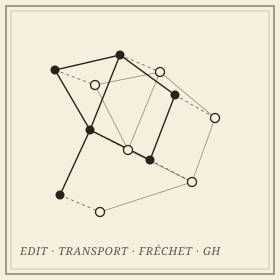

```{=html}
<header class="masthead page">
  <div class="kicker">Research &middot; Plate III</div>
  <div class="pub-title">Geometric Graph Distances</div>
  <div class="edition">
    <span>Road networks &middot; molecules &middot; embedded graphs</span>
    <span>With Carola Wenk and Vitaliy Kurlin</span>
    <span>Updated MMXXVI</span>
  </div>
</header>

<figure class="plate-spread">
  
  <figcaption><b>Two embedded graphs</b>&mdash;and a correspondence between them. Every distance on this page is a way of pricing such a matching: by edits, by transport, by traversal, or by distortion.</figcaption>
</figure>

<div class="lede">
  <div class="pull-quote">
    &ldquo;Two road maps of the same city never agree. The question is how to say by how much, in a way a computer can check and a theorem can use.&rdquo;
  </div>
  <p>A geometric graph is a combinatorial graph together with an embedding in Euclidean space, and it carries both kinds of structure at once. Comparing two of them is a central problem wherever networks are measured rather than designed: reconstructed road maps against ground truth, molecular skeletons, vascular and neuronal trees. The distances proposed for the task pull in different directions&mdash;some are true metrics but NP-hard, some are fast but blind to the geometry, some are stable and some are not.</p>
  <p>This project organizes that landscape by what governs usefulness: the <em>metric axioms</em>, the <em>computational complexity</em>, and the <em>stability</em> of each distance under perturbations of the embedding. It then asks what the organization is for: which comparisons need a matching-based distance, which are better served by an isometry-invariant descriptor, and how fast either can be computed.</p>
</div>
```

## Work in this line

```{=html}
<div class="section-byline">
  <span>Filed under <em>Theory</em></span>
  <span>MMXXIII&ndash;MMXXVI</span>
</div>
<p class="section-kicker">Edit, transport, traversal, distortion.</p>
```

- ***Distances Between Geometric Graphs: A Survey of Metric and Computational Properties***&mdash;an invited chapter for the AMS *Contemporary Mathematics* volume on Geometric Data Science: edit-based, transport-based, and correspondence-based distances compared on metric axioms, complexity, and stability, with the open problems collected. In preparation.
- ***[Distance Measures for Geometric Graphs](https://doi.org/10.1016/j.comgeo.2023.102056)***&mdash;with Carola Wenk; the geometric edit distance and geometric graph distance, their metric properties, and the NP-hardness of computing them. *Computational Geometry: Theory and Applications*.
- ***Graph Mover's Distance: An Efficiently Computable Distance Measure for Geometric Graphs***&mdash;a transport-based alternative that is computable in polynomial time. CCCG&nbsp;2023.
- ***Metric and Path-Connectedness Properties of the Fr&eacute;chet Distance for Paths and Graphs***&mdash;with Erin Chambers, Brittany Fasy, Benjamin Holmgren, and Carola Wenk. CCCG&nbsp;2023.

## Open questions

```{=html}
<div class="section-byline">
  <span>Filed under <em>Open Problems</em></span>
  <span>A weekly working group, fall MMXXVI</span>
</div>
<p class="section-kicker">Complete, fast, and stable&mdash;pick three.</p>
```

Whether an isometry-invariant descriptor of a geometric graph can be *complete*, distinguishing every pair of non-isometric graphs, and still be computed in polynomial time; how much of the modern machinery for fast and approximate optimal transport carries over to the distances between such invariants; and the metric geometry of the space of embedded graphs itself&mdash;its connectedness, its geodesics, and what a small perturbation of the embedding is allowed to do. A student thread asks the learning version: when can a graph neural network be trained to match geometric graphs, and what does it certify when it does?

## Collaborators

```{=html}
<div class="section-byline">
  <span>Filed under <em>Co-authors</em></span>
  <span>Four institutions, two countries</span>
</div>
<p class="section-kicker">A former advisor and a new collaborator.</p>
```

- Carola Wenk, Tulane University
- Vitaliy Kurlin, University of Liverpool
- Erin Chambers, University of Notre Dame
- Brittany Fasy, Montana State University

## Publications

::: {#refs}
:::

```{=html}
<aside class="colophon" style="margin-top: 3rem;">
  <span class="monogram">&#10086;</span>
  <p>Back to the <a href="../">research overview</a>, or read about <a href="gh.html">Gromov&ndash;Hausdorff distances</a>, the correspondence-based distance at the end of this list.</p>
</aside>
```
