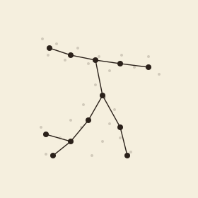

```{=html}
<header class="masthead page">
  <div class="kicker">Research &middot; Plate II</div>
  <div class="pub-title">Geometric Graph Reconstruction</div>
  <div class="edition">
    <span>Filamentary structures &middot; metric graphs &middot; noisy samples</span>
    <span>Seven collaborators</span>
    <span>Updated MMXXVI</span>
  </div>
</header>

<figure class="plate-spread">
  
  <figcaption><b>A finite sample</b>&mdash;noisy points in the plane and the embedded metric graph reconstructed from them: edges, vertices, branch structure.</figcaption>
</figure>

<div class="lede">
  <div class="pull-quote">
    &ldquo;Filamentary structures are the world's most common topology, and the most often misread.&rdquo;
  </div>
  <p>Filamentary structures&mdash;embedded graphs whose metric is inherited from the ambient space&mdash;show up everywhere in the wild: GPS traces over road networks, earthquake catalogues along plate boundaries, neuronal arbors, blood vessels, the cosmic web. This project reconstructs the topology and geometry of such metric graphs from finite, noisy samples drawn near them, both under Gromov&ndash;Hausdorff (intrinsic) and Hausdorff (extrinsic, Euclidean) noise models.</p>
  <p>The recurring shape of a result: identify a sampling condition&mdash;a density &amp; reach assumption, often&mdash;under which the Vietoris&ndash;Rips or Reeb-graph reconstruction is quasi-isometric to the embedded graph it was drawn from. The work is in finding conditions weak enough to hold for real GPS data and strong enough to admit a theorem.</p>
</div>
```

## Active threads

```{=html}
<div class="section-byline">
  <span>Filed under <em>Theory &middot; Open Problems</em></span>
  <span>Three threads</span>
</div>
<p class="section-kicker">From GPS traces to earthquake catalogues to neuronal arbors.</p>
```

- ***[Vietoris&ndash;Rips Shadow for Euclidean Graph Reconstruction](https://arxiv.org/abs/2506.01603)***&mdash;with Rafal Komendarczyk and Atish Mitra; reconstruction guarantees under the Hausdorff noise model. In press at the *Journal of Applied and Computational Topology*.
- Reeb-graph reconstruction under relaxed density assumptions&mdash;provable schemes when the sample is metrically close *only locally*.
- Distance measures for geometric graphs&mdash;*geometric edit distance*, *graph mover's distance*, and Fr&eacute;chet-style metrics on the space of embedded graphs.

## Collaborators

```{=html}
<div class="section-byline">
  <span>Filed under <em>Co-authors</em></span>
  <span>Seven institutions</span>
</div>
<p class="section-kicker">Seven institutions, two former advisors.</p>
```

- Rafal Komendarczyk, Tulane University
- Atish Mitra, Montana Technological University
- Halley Fritze, University of Oregon
- Marissa Masden, University of Puget Sound
- Vitaliy Kurlin, University of Liverpool
- Erin Chambers, St. Louis University *(past)*
- Carola Wenk, Tulane University *(past)*

## Publications

::: {#refs}
:::

```{=html}
<aside class="colophon" style="margin-top: 3rem;">
  <span class="monogram">&#10086;</span>
  <p>Back to the <a href="../">research overview</a>, or read about <a href="shape-recon.html">shape &amp; manifold reconstruction</a>, the higher-dimensional cousin.</p>
</aside>
```
