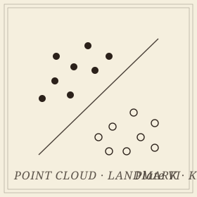

```{=html}
<header class="masthead page">
  <div class="kicker">Research &middot; Plate IV</div>
  <div class="pub-title">Topological Kernels for Machine Learning</div>
  <div class="edition">
    <span>Provable kernel methods for point-cloud and graph classification</span>
    <span>Three collaborators</span>
    <span>Updated MMXXVI</span>
  </div>
</header>

<figure class="plate-spread">
  
  <figcaption><b>Two classes</b>&mdash;each a point cloud, mapped through a topological kernel into a feature space where a linear classifier suffices.</figcaption>
</figure>

<div class="lede">
  <div class="pull-quote">
    &ldquo;A kernel that classifies but cannot be argued with is a kernel that has not been understood. The work is in writing the guarantees down.&rdquo;
  </div>
  <p>The setting: a point cloud or a graph carries topological signal&mdash;connectedness, loops, voids&mdash;that ordinary descriptors quietly discard. A line of work, with <a href="https://www.mtech.edu/cls/atish-mitra/">Atish Mitra</a>, <a href="https://ziga-virk.github.io/">&Zcaron;iga Virk</a>, and <a href="https://pramita-bagchi.github.io/">Pramita Bagchi</a>, aims to put topological data analysis on the same theoretical footing as kernel methods in machine learning. The kernels are closed-form, the landmarks are chosen with care, and the resulting classifiers come with proofs of stability, expressivity, and sample complexity.</p>
  <p>The recurring shape: define a kernel that reads topological signal through carefully chosen <em>landmarks</em>, evaluate it in closed form, and certify the downstream classifier. The certification is the point. Without it, what one has is a useful classifier; with it, a usable theorem.</p>
</div>
```

## Recent papers

```{=html}
<div class="section-byline">
  <span>Filed under <em>Theory &middot; Open Problems</em></span>
  <span>Three papers, MMXXVI</span>
</div>
<p class="section-kicker">Two kernels, a multiparameter successor, and where the certificate stops.</p>
```

- ***[A Closed-Form Adaptive-Landmark Kernel for Certified Point-Cloud and Graph Classification](https://arxiv.org/abs/2605.04046)***&mdash;an adaptive landmark scheme with closed-form kernel evaluation, submitted to *Journal of Machine Learning Research*.
- ***COMPLEX: a closed-form certified embedding of multiparameter persistence modules***&mdash;the multiparameter successor. Every multiparameter vectorization in the literature carries a one-sided Lipschitz bound and nothing below it; under a checkable witnessing-slice condition this one carries a closed-form *lower* gauge too, giving the first two-sided distortion bound for a multiparameter feature map. It also reports where the guarantee stops: local per-prediction certification fails, for a structural reason shared by every landmark embedding whose lower gauge is witnessed by one coordinate. In preparation.
- ***[A Closed-Form Persistence-Landmark Pipeline for Certified Point-Cloud and Graph Classification](https://arxiv.org/abs/2605.02836)***&mdash;a persistence-based variant, published in *Transactions on Machine Learning Research*.

## Collaborators

```{=html}
<div class="section-byline">
  <span>Filed under <em>Co-authors</em></span>
  <span>Three institutions, two countries</span>
</div>
<p class="section-kicker">Three institutions, two countries, one program.</p>
```

- Atish Mitra, Montana Technological University
- &Zcaron;iga Virk, University of Ljubljana
- Pramita Bagchi, The George Washington University

```{=html}
<aside class="colophon" style="margin-top: 3rem;">
  <span class="monogram">&#10086;</span>
  <p>Back to the <a href="../">research overview</a>, or read about the <a href="statistics.html">statistics</a> that makes these kernels testable.</p>
</aside>
```
