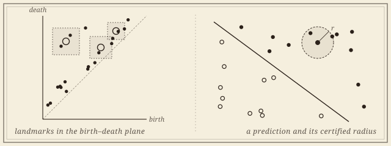
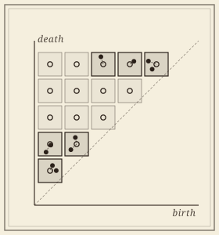
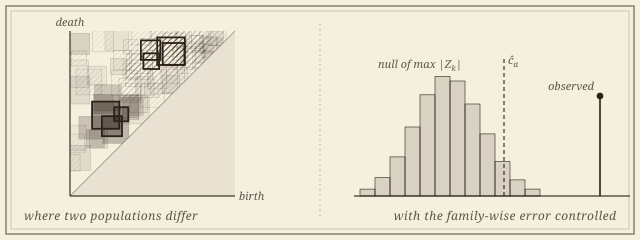

```{=html}
<header class="masthead page">
  <div class="kicker">Research &middot; Plate III</div>
  <div class="pub-title">Certified Topological Learning</div>
  <div class="edition">
    <span>The landmark framework &middot; embeddings &middot; inference &middot; multiparameter &middot; software</span>
    <span>Four collaborators and a student team</span>
    <span>Updated MMXXVI</span>
  </div>
</header>

<figure class="plate-spread">
  
  <figcaption><b>From diagram to certificate</b>&mdash;a persistence diagram read through a few landmarks, in closed form; and a prediction made on that reading, with a radius inside which no perturbation of the input can change it.</figcaption>
</figure>

<div class="lede">
  <div class="pull-quote">
    &ldquo;A kernel that classifies but cannot be argued with is a kernel that has not been understood. The work is in writing the guarantees down.&rdquo;
  </div>
  <p>A point cloud or a graph carries topological signal&mdash;connectedness, loops, voids&mdash;that ordinary descriptors quietly discard, and persistence diagrams record it. Using them in earnest needs three things the field has lacked: a vectorization that loses nothing it is forbidden to lose, statistics that say when two populations of diagrams honestly differ, and code that anyone can run. This program, with <a href="https://www.mtech.edu/cls/atish-mitra/">Atish Mitra</a>, <a href="https://ziga-virk.github.io/">&Zcaron;iga Virk</a>, <a href="https://pramita-bagchi.github.io/">Pramita Bagchi</a>, and Nicol&ograve; Zava, supplies all three from a single idea: read the diagram through a few carefully chosen <em>landmarks</em>, in closed form.</p>
  <p>It began as a trilogy. <a href="https://arxiv.org/abs/2605.02836">PLACE</a> gave the representation and <a href="https://arxiv.org/abs/2605.04046">PALACE</a> the adaptive kernel; the inference theory made both testable, with rates matched by minimax lower bounds. It now reaches past one filtration parameter, and it ships as <a href="https://akriti.io"><code>akriti</code></a>.</p>
</div>
```

## Embeddings

```{=html}
<div class="section-byline">
  <span>Filed under <em>Learning</em></span>
  <span>PLACE &middot; PALACE</span>
</div>
<p class="section-kicker">A bound in both directions, in closed form.</p>
```

```{=html}
<figure class="fig-right">
  
  <figcaption style="font-size:0.85rem">Landmark windows tiling the birth&ndash;death plane; each diagram point is read by the landmark whose window holds it.</figcaption>
</figure>
```

Every vectorization of a persistence diagram carries a bound in one direction: nearby diagrams stay near. Almost none forbids distinct diagrams from collapsing together. The landmark embeddings supply that second bound, in closed form and without training, and it is what turns a classifier built on them into one that can certify each prediction.

1. **A Closed-Form Adaptive-Landmark Kernel for Certified Point-Cloud and Graph Classification** (PALACE). With Atish Mitra, &Zcaron;iga Virk, and Pramita Bagchi. Under review at the *Journal of Machine Learning Research*. [arXiv](https://arxiv.org/abs/2605.04046).
1. **A Closed-Form Persistence-Landmark Pipeline for Certified Point-Cloud and Graph Classification** (PLACE). With Atish Mitra, &Zcaron;iga Virk, and Pramita Bagchi. *Transactions on Machine Learning Research*, 2026. [TMLR](https://openreview.net/forum?id=4kZxNlE5Ve) &middot; [arXiv](https://arxiv.org/abs/2605.02836).

## Inference

```{=html}
<div class="section-byline">
  <span>Filed under <em>Statistics</em></span>
  <span>Estimation &middot; testing &middot; localization</span>
</div>
<p class="section-kicker">Whether two populations differ, where, and by how much.</p>
```

Topological summaries are routinely compared across groups of patients, materials, or simulations, and the comparisons are routinely made by eye. With the statistician Pramita Bagchi, this line builds the inferential layer: estimators with rates, two-sample tests with calibrated error, confidence sets, and maps of *where* in the birth&ndash;death plane two populations differ.

```{=html}
<figure class="plate-spread">
  
  <figcaption><b>Where, and whether</b>&mdash;landmark windows tiling the birth&ndash;death plane, shaded by how strongly two populations differ there, with the few that survive a simultaneous test outlined; and the calibration behind them.</figcaption>
</figure>
```

1. [**Where Do Two Populations of Persistence Diagrams Differ? Simultaneous Localization in the Birth&ndash;Death Plane.** With Pramita Bagchi, Edward Bae, Atish Mitra, Alexander D. Silberman, and &Zcaron;iga Virk. In preparation.]{.in-prep}
1. **Statistical Inference for Persistence Diagrams via Landmark Embeddings: Minimax Theory and Finite Approximation.** With Pramita Bagchi, Atish Mitra, and &Zcaron;iga Virk. Preprint, 2026. [arXiv](https://arxiv.org/abs/2609.07691).\
   [Covariance estimators, two-sample tests, and confidence balls for the landmark embeddings, with matching minimax rates, and an application to resting-state brain connectivity.]{.synopsis}

```{=html}
<div class="roster-head">Workshop contributions</div>
```

::: {.workshop-list}
- *Statistical Analysis of Persistence Landmarks: A Hilbert Space Embedding of the Space of Persistence Diagrams.* With Pramita Bagchi, Atish Mitra, and &Zcaron;iga Virk. Fall Workshop on Computational Geometry, 2025.
:::

## Beyond one parameter

```{=html}
<div class="section-byline">
  <span>Filed under <em>Learning &middot; Theory</em></span>
  <span>Multiparameter persistence</span>
</div>
<p class="section-kicker">The same guarantee, when one filtration is not enough.</p>
```

Real data rarely comes with a single natural filtration; scale and density, or scale and time, want to vary together. Multiparameter persistence captures that, and its vectorizations, like their one-parameter ancestors, carry an upper bound and nothing below it. This line carries the landmark guarantee to several parameters, and asks what the space of multiparameter modules looks like at large scale.

1. **COMPLEX: A Closed-Form Certified Embedding of Multiparameter Persistence Modules.** With Atish Mitra, &Zcaron;iga Virk, and Pramita Bagchi. Preprint, 2026. [arXiv](https://arxiv.org/abs/2609.22012).\
   [A closed-form, training-free embedding of multiparameter modules, with the first two-sided distortion bound for a multiparameter feature map&mdash;and an honest account of where per-prediction certification stops.]{.synopsis}
1. [**Coarse Embeddings and Asymptotic Dimension of Multiparameter Persistence.** With Atish Mitra, &Zcaron;iga Virk, and Nicol&ograve; Zava. In preparation.]{.in-prep}

## Software: `akriti`

```{=html}
<div class="section-byline">
  <span>Filed under <em>Open Source &middot; Founder and lead</em></span>
  <span><a href="https://akriti.io">akriti.io</a> &middot; <a href="https://github.com/akritihq/akriti">GitHub</a> &middot; <a href="https://pypi.org/project/akriti/">PyPI</a> &middot; Apache-2.0</span>
</div>
<p class="section-kicker"><span>Where the framework becomes something anyone can run.</span></p>
```

Named for the Sanskrit *ākṛti* (आकृति), "shape, form," [`akriti`](https://akriti.io) is the open-source Python software project I founded and lead, with a student developer team. It delegates the computation of persistence to the established engines&mdash;GUDHI, Ripser, Hera&mdash;and owns what comes after: the certified landmark embeddings, two-sample tests, effect sizes, maps of where two populations differ, and sample-size calculation for a topological effect. Each paper on this page becomes a module. The team works in the open, with onboarding documents, public design RFCs, code review, and credit; software engineering, like proof writing, is taught by apprenticeship.

## Collaborators

```{=html}
<div class="section-byline">
  <span>Filed under <em>Co-authors</em></span>
  <span>Four present, and students</span>
</div>
<p class="section-kicker">Four institutions, three countries, one program.</p>
```

```{=html}
<div class="roster-head">Present</div>
```

- [Atish Mitra]{.collab}, *Montana Technological University*
- [&Zcaron;iga Virk]{.collab}, *University of Ljubljana*
- [Pramita Bagchi]{.collab}, *The George Washington University*
- [Nicol&ograve; Zava]{.collab}, *IST Austria*

```{=html}
<div class="roster-head">Students</div>
```

- [Edward Bae]{.collab}
- [Alexander D. Silberman]{.collab}

```{=html}
<aside class="colophon" style="margin-top: 3rem;">
  <span class="monogram">&#10086;</span>
  <p>Back to the <a href="../">research overview</a>, or read about <a href="networks.html">topology inside neural networks</a>, where the same discipline of certified measurement meets deep learning.</p>
</aside>
```
