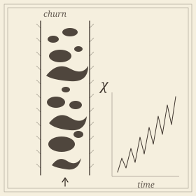

```{=html}
<header class="masthead page">
  <div class="kicker">Research &middot; Plate VIII</div>
  <div class="pub-title">Multiphase Flow at the Montana Tech Loop</div>
  <div class="edition">
    <span>Churn flow &middot; regime maps &middot; tracking-free measurement</span>
    <span>Eleven hours of video, two pipe diameters</span>
    <span>Updated MMXXVI</span>
  </div>
</header>

<figure class="plate-spread">
  
  <figcaption><b>Churn flow in a vertical pipe</b>&mdash;gas structures merging and splitting, and the Euler characteristic &chi;(t) that counts the events without tracking a single bubble.</figcaption>
</figure>

<div class="lede">
  <div class="pull-quote">
    &ldquo;Churn flow is the regime everyone recognizes and no one has defined. Every coalescence is a change in Euler characteristic, which turns out to be enough.&rdquo;
  </div>
  <p>Gas and liquid rising together in a vertical pipe organize into regimes&mdash;bubbly, slug, churn, annular&mdash;and the boundaries between them are drawn by empirical maps fitted to observation. Churn, the violent transitional regime, has never had a mathematical definition. It is identified by eye.</p>
  <p>This is a collaboration with the petroleum engineering department at Montana Technological University, whose vertical flow loop (MTVFL) runs 1-, 2- and 3-inch pipes under controlled gas and liquid rates. The observation that organizes the work is elementary: every coalescence or breakup of gas structures is a <em>topological</em> event, so the Euler characteristic of the thresholded video frame changes exactly when the flow reorganizes. Computed per frame, with no bubble tracked and no interface segmented, &chi;(t) becomes a measurement channel&mdash;and it works precisely where particle tracking fails, in the dense churn-turbulent regime where closure models are least trusted.</p>
</div>
```

## Results

```{=html}
<div class="section-byline">
  <span>Filed under <em>Application &middot; Measurement</em></span>
  <span>Three manuscripts, MMXXVI</span>
</div>
<p class="section-kicker">A definition, a correction, and a rate nobody had measured.</p>
```

- ***[Topological Characterization of Churn Flow and Unsupervised Correction to the Wu Flow-Regime Map](https://arxiv.org/abs/2604.06167)***&mdash;a topological signature that separates churn from slug at high significance, giving churn its first mathematical definition; the inferred slug/churn boundary sits systematically above the mechanistic prediction, and the classifier transfers to the Texas A&amp;M facility with no retraining. Under review at the *International Journal of Multiphase Flow*.
- ***Interfacial events in gas&ndash;liquid pipe flow are not paced by turbulence***&mdash;coalescence and breakup rates measured directly from eleven hours of video across two pipe diameters, without tracking. Population-balance kernels assume the turbulent transit time sets the pace; the measurement says otherwise, and what does set it remains open. In preparation.
- ***The imaging discipline a topological flow measurement requires***&mdash;what preprocessing, evaluation conventions and manual steps actually cost. Choices usually reported in a single sentence move conclusions by more than most of the physical effects under study. In preparation.

## Why a laboratory

```{=html}
<div class="section-byline">
  <span>Filed under <em>Method</em></span>
  <span>On instruments</span>
</div>
<p class="section-kicker">A theorem that survives a flow loop.</p>
```

```{=html}
<p>The appeal of working inside an experimental facility is that it refuses the usual courtesy extended to topological methods. A stability theorem is an honest claim about perturbations; a flow loop asks whether the claim survives glare, bubbles out of focus, a camera moved between campaigns, and an operator who thresholded by eye in 2019. Most of what we learned here is about that gap&mdash;which is why one of the three manuscripts is about the imaging discipline rather than the physics.</p>
```

## Collaborators

```{=html}
<div class="section-byline">
  <span>Filed under <em>Co-authors</em></span>
  <span>Petroleum engineering &amp; mathematics</span>
</div>
<p class="section-kicker">A department head, a lab director, and the rig.</p>
```

- Atish Mitra, Montana Technological University
- **B. Todd Hoffman**, Department Head, Petroleum Engineering, Montana Technological University
- **Dave Rathgeber**, Laboratory Director, Montana Technological University &mdash; *who runs the loop*
- Burt Todd, Montana Technological University
- Brady Koenig, Montana Technological University
- Abigail Stein, George Washington University *(undergraduate)*

```{=html}
<aside class="colophon" style="margin-top: 3rem;">
  <span class="monogram">&#10086;</span>
  <p>Back to the <a href="../">research overview</a>, or read about the descriptor doing the work here&mdash;<a href="euler.html">Euler characteristic methods</a>&mdash;and its use on <a href="dynamics.html">time series and dynamics</a> more broadly.</p>
</aside>
```
