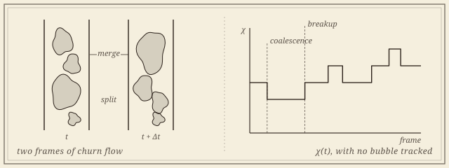

```{=html}
<header class="masthead page">
  <div class="kicker">Research &middot; Plate VI</div>
  <div class="pub-title">Multiphase Flow at the Montana Tech Loop</div>
  <div class="edition">
    <span>Churn flow &middot; regime maps &middot; tracking-free measurement</span>
    <span>Eleven hours of video, two pipe diameters</span>
    <span>Updated MMXXVI</span>
  </div>
</header>

<figure class="plate-spread">
  
  <figcaption><b>Churn flow, counted</b>&mdash;gas structures merging and splitting between two frames; and the Euler characteristic &chi;(t) of each thresholded frame, which changes exactly when the flow reorganizes, with no bubble tracked.</figcaption>
</figure>

<div class="lede">
  <div class="pull-quote">
    &ldquo;Churn flow is the regime everyone recognizes and no one has defined. Every coalescence is a change in Euler characteristic, which turns out to be enough.&rdquo;
  </div>
  <p>Gas and liquid rising together in a vertical pipe organize into regimes&mdash;bubbly, slug, churn, annular&mdash;and the boundaries between them are drawn by empirical maps fitted to observation. Churn, the violent transitional regime, has never had a mathematical definition. It is identified by eye.</p>
  <p>This is a collaboration with the petroleum engineering department at Montana Technological University, whose vertical flow loop (MTVFL) runs 1-, 2- and 3-inch pipes under controlled gas and liquid rates. The observation that organizes the work is elementary: every coalescence or breakup of gas structures is a <em>topological</em> event, so the Euler characteristic of the thresholded video frame changes exactly when the flow reorganizes. Computed per frame, with no bubble tracked and no interface segmented, &chi;(t) becomes a measurement channel&mdash;and it works precisely where particle tracking fails, in the dense churn-turbulent regime where closure models are least trusted.</p>
</div>
```

## Papers

```{=html}
<div class="section-byline">
  <span>Filed under <em>Application &middot; Measurement</em></span>
  <span>Churn flow &middot; regime maps &middot; imaging</span>
</div>
<p class="section-kicker">A definition, a correction, and an instrument read honestly.</p>
```

1. [**Tracking-Free Topological Activity in Gas&ndash;Liquid Pipe Flow: Calibration, Precision, and What the Rate Measures.** With Atish Mitra, B. Todd Hoffman, and Burt Todd. In preparation.\
   [An Euler-characteristic activity channel read from eleven hours of video, calibrated against high-speed conductance probes before any physics is read from it.]{.synopsis}]{.in-prep}
1. [**What Evaluation Conventions Are Worth in Image-Based Flow-Regime Identification.** With Atish Mitra, B. Todd Hoffman, and Burt Todd. In preparation.\
   [What the preprocessing, evaluation conventions, and manual steps in the field actually cost.]{.synopsis}]{.in-prep}
1. **Topological Characterization of Churn Flow and Unsupervised Correction to the Wu Flow-Regime Map in Small-Diameter Vertical Pipes.** With Brady Koenig, Atish Mitra, Abigail Stein, and Burt Todd. Under review at the *International Journal of Multiphase Flow*. [arXiv](https://arxiv.org/abs/2604.06167).\
   [A topological signature that separates churn from slug, giving churn its first mathematical definition; the inferred slug&ndash;churn boundary sits systematically above the mechanistic prediction, and the classifier transfers to the Texas A&amp;M facility with no retraining.]{.synopsis}

::: {.open-q}
Why a laboratory: a stability theorem is an honest claim about perturbations, and a flow loop asks whether the claim survives glare, bubbles out of focus, a camera moved between campaigns, and an operator who thresholded by eye. Much of what the work has learned is about that gap, which is why one of the manuscripts is about the imaging discipline rather than the physics.
:::

## Collaborators

```{=html}
<div class="section-byline">
  <span>Filed under <em>Co-authors</em></span>
  <span>Three present, three past</span>
</div>
<p class="section-kicker">Petroleum engineering and mathematics, on the same rig.</p>
```

```{=html}
<div class="roster-head">Present</div>
```

- [Atish Mitra]{.collab}, *Montana Technological University*
- [B. Todd Hoffman]{.collab}, *Petroleum Engineering, Montana Technological University*
- [Dave Rathgeber]{.collab}, *Laboratory Director, Montana Technological University*, who runs the loop

```{=html}
<div class="roster-head">Past</div>
```

- [Burt Todd]{.collab}, *Montana Technological University*
- [Brady Koenig]{.collab}, *Montana Technological University*
- [Abigail Stein]{.collab}, *The George Washington University*, undergraduate co-author

```{=html}
<aside class="colophon" style="margin-top: 3rem;">
  <span class="monogram">&#10086;</span>
  <p>Back to the <a href="../">research overview</a>, or read about the descriptor doing the work here, in <a href="euler.html">topology in time series and dynamics</a>.</p>
</aside>
```
