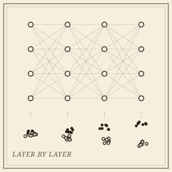

```{=html}
<header class="masthead page">
  <div class="kicker">Research &middot; Plate VI</div>
  <div class="pub-title">Topology Inside Neural Networks</div>
  <div class="edition">
    <span>Disentanglement &middot; memorization &middot; depth</span>
    <span>Exact tests, not eyeball curves</span>
    <span>Updated MMXXVI</span>
  </div>
</header>

<figure class="plate-spread">
  
  <figcaption><b>Layer by layer</b>&mdash;two class clouds, entangled at the input and pulled apart with depth. The question is not whether the picture looks like this, but whether a test says so.</figcaption>
</figure>

<div class="lede">
  <div class="pull-quote">
    &ldquo;<em>Layer &ell;+1 is more disentangled than layer &ell;</em> is the sentence every such study wants to write. Until now it had no null.&rdquo;
  </div>
  <p>Much of what is said about the inside of a trained network&mdash;that classes separate with depth, that a generative model has memorized its training set, that a mitigation removed the memorization&mdash;rests on descriptive curves and thresholds chosen by eye. This project brings the <a href="euler.html">Euler characteristic program</a> and its <a href="statistics.html">statistics</a> to the network itself: every number carries a test, with a stated null and calibrated error.</p>
  <p>The instrument is the intersection Euler characteristic profile, the Euler characteristic of the overlap of two point clouds' ball unions as a function of scale, computed from a single alpha-complex sweep. Applied to the class clouds of a representation, it measures how much two classes still interact; applied across layers and training, it says where and when they stop.</p>
</div>
```

## Papers

```{=html}
<div class="section-byline">
  <span>Filed under <em>Learning</em></span>
  <span>MMXXVI</span>
</div>
<p class="section-kicker">Disentanglement, memorization, and where each happens.</p>
```

- ***[Certified Topological Interaction in Neural Representations: Class Disentanglement Is Mostly Pairwise](https://arxiv.org/abs/2609.08561)***&mdash;exact permutation tests, a separation certificate, and paired tests for comparative claims, across 111 networks and 52,650 measurements. Disentanglement is depth-graded and early; the joint entanglement of a class triple almost always sits below its strongest pair, in vision encoders and frozen language models alike. Building the test taught a lesson that outlives the invariant: the statistic must be scale-free, or the certificate certifies feature-norm dynamics instead.
- ***The Null Is the Hard Part: Exact Tests for Memorization in Generative Models***&mdash;what memorization audits of diffusion models find once the null is stated exactly and the false discoveries are controlled; the field's standard data-copying test, it turns out, flags generators that copy nothing. In preparation.
- ***Where a Classifier Absorbs Label Noise, Certified Layer by Layer***&mdash;a network fitted to noisy labels memorizes them in a fixed place: the flipped labels certify only in the last stage and the penultimate layer, and never earlier, while training choices move only the onset. In preparation.

## Open questions

```{=html}
<div class="section-byline">
  <span>Filed under <em>Open Problems</em></span>
  <span>Theory to follow</span>
</div>
<p class="section-kicker">From measurements to theorems.</p>
```

Why class structure in a representation should be mostly pairwise, and whether that is a law or a regularity of current architectures; what a layer does to the *shape* of a class, measured by computable bounds on the Gromov&ndash;Hausdorff distance rather than by topology alone; and a learning-theoretic account of the certified depth of memorization, connecting where a network absorbs noise to how well it generalizes.

```{=html}
<aside class="colophon" style="margin-top: 3rem;">
  <span class="monogram">&#10086;</span>
  <p>Back to the <a href="../">research overview</a>, or read about the <a href="euler.html">Euler characteristic methods</a> that supply the instrument.</p>
</aside>
```
