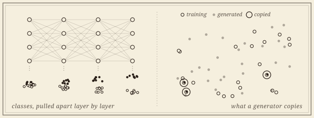
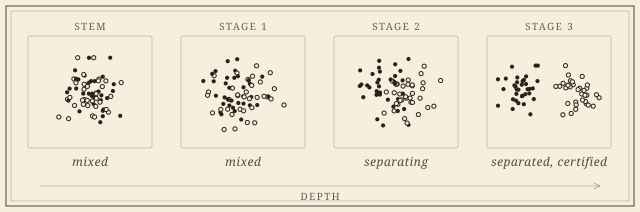

```{=html}
<header class="masthead page">
  <div class="kicker">Research &middot; Plate IV</div>
  <div class="pub-title">Topology Inside Neural Networks</div>
  <div class="edition">
    <span>Disentanglement &middot; memorization &middot; depth</span>
    <span>Exact tests, not eyeball curves</span>
    <span>Updated MMXXVI</span>
  </div>
</header>

<figure class="plate-spread">
  
  <figcaption><b>Two questions about a trained network</b>&mdash;where, layer by layer, it pulls its classes apart; and which of a generator's samples are copies of its training data. Neither is answered by looking; both are answered here by a test.</figcaption>
</figure>

<div class="lede">
  <div class="pull-quote">
    &ldquo;<em>Layer &ell;+1 is more disentangled than layer &ell;</em> is the sentence every such study wants to write. Until now it had no null.&rdquo;
  </div>
  <p>Much of what is said about the inside of a trained network&mdash;that classes separate with depth, that a generative model has memorized its training set, that a mitigation removed the memorization&mdash;rests on descriptive curves and thresholds chosen by eye. This project brings the <a href="euler.html">Euler characteristic program</a> and its <a href="landmark.html">statistics</a> to the network itself: every number carries a test, with a stated null and calibrated error.</p>
  <p>The instrument is the intersection Euler characteristic profile, the Euler characteristic of the overlap of two point clouds' ball unions as a function of scale, computed from a single alpha-complex sweep. Applied to the class clouds of a representation, it measures how much two classes still interact; applied across layers and training, it says where and when they stop.</p>
</div>
```

## Disentanglement

```{=html}
<div class="section-byline">
  <span>Filed under <em>Learning</em></span>
  <span>Representations &middot; depth &middot; training</span>
</div>
<p class="section-kicker">Where a network pulls its classes apart, with a null.</p>
```

```{=html}
<figure class="plate-spread">
  
  <figcaption><b>Two classes, four depths</b>&mdash;the class clouds of a trained network at its stem and three stages. The separation becomes visible by the third stage; the test says when it becomes real.</figcaption>
</figure>
```

1. **Certified Topological Interaction in Neural Representations: Class Disentanglement Is Mostly Pairwise.** Preprint, 2026. [arXiv](https://arxiv.org/abs/2609.08561).\
   [Exact permutation tests, a separation certificate, and paired tests for comparative claims, across 111 networks and 52,650 measurements. Disentanglement is depth-graded and early; the joint entanglement of a class triple almost always sits below its strongest pair, in vision encoders and frozen language models alike. Building the test taught a lesson that outlives the invariant: the statistic must be scale-free, or the certificate certifies feature-norm dynamics instead.]{.synopsis}

::: {.open-q}
An open question: why class structure in a representation should be mostly pairwise, and whether that is a law or a regularity of current architectures; and what a layer does to the *shape* of a class, measured by computable bounds on the Gromov&ndash;Hausdorff distance rather than by topology alone.
:::

## Memorization

```{=html}
<div class="section-byline">
  <span>Filed under <em>Learning &middot; Statistics</em></span>
  <span>Generative models &middot; label noise</span>
</div>
<p class="section-kicker">What a model has copied, stated as a test rather than a score.</p>
```

Memorization is usually reported as a score against a threshold chosen by eye. Stated as a hypothesis test, it needs an exact null and control of false discoveries, for the samples a generative model produces and for the labels a classifier absorbs. A related question for classifiers trained on noisy labels: where, in depth, does a network store the labels it memorizes, and does that place move as training changes?

1. [**The Null Is the Hard Part: Exact Tests for Memorization in Generative Models.** With Pramita Bagchi. In preparation.]{.in-prep}

## Collaborators

```{=html}
<div class="section-byline">
  <span>Filed under <em>Co-authors</em></span>
  <span>A statistician, and the Euler program behind the instrument</span>
</div>
<p class="section-kicker">Measurement with a stated null.</p>
```

```{=html}
<div class="roster-head">Present</div>
```

- [Pramita Bagchi]{.collab}, *The George Washington University*

```{=html}
<aside class="colophon" style="margin-top: 3rem;">
  <span class="monogram">&#10086;</span>
  <p>Back to the <a href="../">research overview</a>, or read about the <a href="euler.html">Euler calculus</a> that supplies the instrument, and the <a href="landmark.html">certified learning</a> program it grew beside.</p>
</aside>
```
