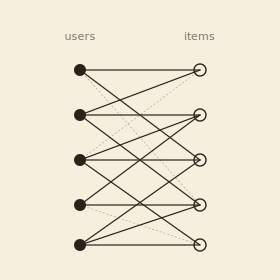

```{=html}
<header class="masthead page">
  <div class="kicker">Research &middot; Plate VII</div>
  <div class="pub-title">Topological Methods for Recommender Systems</div>
  <div class="edition">
    <span>User&ndash;item preference networks &middot; cold-start &middot; long-tail</span>
    <span>Three Master's students</span>
    <span>Updated MMXXVI</span>
  </div>
</header>

<figure class="plate-spread">
  
  <figcaption>The user&ndash;item interaction graph: a bipartite network whose topology&mdash;connectedness, loops, voids in the preference space&mdash;carries signal that ordinary matrix-factorisation and embedding pipelines discard.</figcaption>
</figure>

<div class="lede">
  <div class="pull-quote">
    &ldquo;Topology has been quiet about preferences for too long.&rdquo;
  </div>
  <p>A recent thread, with three Master's students at GWU, applies topological data analysis to recommender systems. The user&ndash;item interaction graph is a bipartite network with structure that ordinary matrix-factorisation and embedding pipelines politely throw away: connectedness, loops, voids in the preference space, the cohomology of how taste clusters and crosses over.</p>
  <p>The work asks how persistence-based and Euler-characteristic descriptors of that network can sharpen recommendation, especially in the cold-start and long-tail regimes where conventional embeddings are starved of co-rating data and reduce, in practice, to popularity.</p>
</div>
```

## Master's students

```{=html}
<div class="section-byline">
  <span>Filed under <em>Co-authors</em></span>
  <span>The George Washington University</span>
</div>
```

- *Alexander D. Silberman*, *M.S.&nbsp;Data Science, GWU*
- *Chinaza Belolisa*, *M.S.&nbsp;Data Science, GWU*
- *Madeline Bumpus*, *M.S.&nbsp;Data Science, GWU*

```{=html}
<aside class="colophon" style="margin-top: 3rem;">
  <span class="monogram">&#10086;</span>
  <p>Back to the <a href="../">research overview</a>, or read about the closely related work on <a href="kernels.html">topological kernels for machine learning</a>.</p>
</aside>
```
