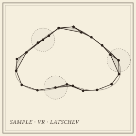

```{=html}
<header class="masthead page">
  <div class="kicker">Research &middot; Plate I</div>
  <div class="pub-title">Shape Reconstruction</div>
  <div class="edition">
    <span>Vietoris&ndash;Rips, &Ccaron;ech, alpha &middot; manifolds and metric graphs</span>
    <span>Nine collaborators</span>
    <span>Updated MMXXVI</span>
  </div>
</header>

<figure class="plate-spread">
  
  <figcaption><b>A sample on a curve</b>&mdash;and the Vietoris&ndash;Rips edges drawn between mutually close samples. The reconstruction theorems decide when this 1-skeleton remembers the curve's topology.</figcaption>
</figure>

<div class="lede">
  <div class="pull-quote">
    &ldquo;When does a finite sample remember the shape it was drawn from? The question is older than data science and shows no sign of being settled.&rdquo;
  </div>
  <p>Reconstructing a geometric shape&mdash;a curve, a manifold, a metric graph, a metric space&mdash;from finite, noisy samples is one of the foundational problems in topological data analysis, and the question that motivates much of the rest of the work on this site. The strategy is to thicken the sample at varying scales using Vietoris&ndash;Rips or &Ccaron;ech complexes, and ask: <em>when, and how faithfully, does the resulting complex remember the shape?</em></p>
  <p>The classical answer is Latschev's theorem (2001): for compact Riemannian manifolds, with sample density and parameter range chosen carefully, the Vietoris&ndash;Rips complex is homotopy-equivalent to the manifold. The work in this project extends Latschev to broader classes of spaces (including CAT(&kappa;) spaces of curvature bounded above, where reach vanishes), makes the parameter ranges sharp and quantitative, and carries the same questions down to dimension one, where the shape is an embedded graph.</p>
</div>
```

## Manifolds and curvature

```{=html}
<div class="section-byline">
  <span>Filed under <em>Theory</em></span>
  <span>MMXXIV&ndash;MMXXVI</span>
</div>
<p class="section-kicker">From Latschev's theorem to CAT(&kappa;) spaces.</p>
```

- ***[Topological Stability and Latschev-type Reconstruction Theorems for Spaces of Curvature Bounded Above](https://arxiv.org/abs/2406.04259)***&mdash;with Rafal Komendarczyk and Will Tran; extends Latschev's classical reconstruction theorem to spaces of curvature bounded above, the first guarantees where both reach and &mu;-reach vanish.
- ***[The Shadow of Vietoris&ndash;Rips Complexes in Limits](https://arxiv.org/abs/2601.01359)***&mdash;with Kazuhiro Kawamura and Atish Mitra.
- ***Demystifying Latschev's Theorem***&mdash;a quantitative version of the original reconstruction theorem, presented at SoCG&nbsp;2024.
- ***Reconstruction of Transversal Intersections from Separate Samples***&mdash;with Kazuhiro Kawamura; recovering where two shapes cross when each is sampled on its own. In preparation.

## Metric graphs: the one-dimensional case

```{=html}
<div class="section-byline">
  <span>Filed under <em>Theory &middot; Application</em></span>
  <span>Filamentary structures &middot; noisy samples</span>
</div>
<p class="section-kicker">From GPS traces to earthquake catalogs.</p>
```

Filamentary structures&mdash;embedded graphs whose metric is inherited from the ambient space&mdash;show up everywhere: GPS traces over road networks, earthquake hypocenters along plate boundaries, neuronal arbors, the cosmic web. Here the reconstruction is of a metric graph from samples drawn near it, under both Gromov&ndash;Hausdorff (intrinsic) and Hausdorff (extrinsic, Euclidean) noise.

- ***[Vietoris&ndash;Rips Shadow for Euclidean Graph Reconstruction](https://doi.org/10.1007/s41468-026-00242-2)***&mdash;with Rafal Komendarczyk and Atish Mitra; reconstruction guarantees under the Hausdorff noise model. *Journal of Applied and Computational Topology*.
- ***Vietoris&ndash;Rips Shadow for Graph Reconstruction in $\mathbb{R}^N$***&mdash;with Atish Mitra; removing the planar restriction in every ambient dimension through a dimension-free lifting condition, and extracting from the shadow a 1-complex *homeomorphic* to the graph rather than merely homotopy-equivalent. In preparation.
- ***[Faithful Reeb Graph Reconstruction of a Tectonic Subduction Zone from Earthquake Hypocenters](https://arxiv.org/abs/2410.19410)***&mdash;with Halley Fritze, Marissa Masden, Atish Mitra and Michael Stickney; the density assumption relaxed to hold only *locally*, and the scheme run on the global earthquake catalog.
- ***Vietoris&ndash;Rips Complexes of Metric Spaces Near a Metric Graph***&mdash;the intrinsic noise model, in the *Journal of Applied and Computational Topology*.

## Collaborators

```{=html}
<div class="section-byline">
  <span>Filed under <em>Co-authors</em></span>
  <span>Seven institutions</span>
</div>
<p class="section-kicker">Seven institutions, two former advisors.</p>
```

- Rafal Komendarczyk, Tulane University
- Atish Mitra, Montana Technological University
- Kazuhiro Kawamura, University of Tsukuba
- Will Tran, Tulane University
- Halley Fritze, University of Michigan
- Marissa Masden, University of Puget Sound
- Michael Stickney, Montana Bureau of Mines and Geology
- Brittany Fasy, Montana State University *(past)*
- Carola Wenk, Tulane University *(past)*

## Publications

::: {#refs}
:::

```{=html}
<aside class="colophon" style="margin-top: 3rem;">
  <span class="monogram">&#10086;</span>
  <p>Back to the <a href="../">research overview</a>, or read about <a href="gh.html">Gromov&ndash;Hausdorff distances</a>, which do the bookkeeping for every theorem on this page.</p>
</aside>
```
