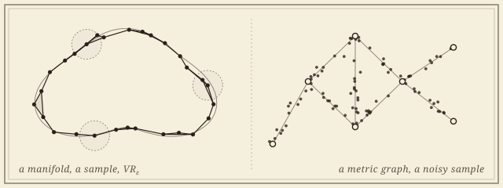

```{=html}
<header class="masthead page">
  <div class="kicker">Research &middot; Plate I</div>
  <div class="pub-title">Shape Reconstruction</div>
  <div class="edition">
    <span>Vietoris&ndash;Rips, &Ccaron;ech, alpha &middot; manifolds and metric graphs</span>
    <span>Nine collaborators</span>
    <span>Updated MMXXVI</span>
  </div>
</header>

<figure class="plate-spread">
  
  <figcaption><b>The two halves of the problem</b>&mdash;a noisy sample near a manifold, with the &epsilon;-balls and Vietoris&ndash;Rips complex that should remember its shape; and a noisy sample near a metric graph, whose vertices, edges, and loops the reconstruction must recover.</figcaption>
</figure>

<div class="lede">
  <div class="pull-quote">
    &ldquo;When does a finite sample remember the shape it was drawn from? The question is older than data science and shows no sign of being settled.&rdquo;
  </div>
  <p>Reconstructing a geometric shape&mdash;a curve, a manifold, a metric graph, a metric space&mdash;from finite, noisy samples is one of the foundational problems in topological data analysis, and the question that motivates much of the rest of the work on this site. The strategy is to thicken the sample at varying scales using Vietoris&ndash;Rips or &Ccaron;ech complexes, and ask: <em>when, and how faithfully, does the resulting complex remember the shape?</em></p>
  <p>The classical answer is Latschev's theorem (2001): for compact Riemannian manifolds, with sample density and parameter range chosen carefully, the Vietoris&ndash;Rips complex is homotopy-equivalent to the manifold. The work in this project extends Latschev to broader classes of spaces (including CAT(&kappa;) spaces of curvature bounded above, where reach vanishes), makes the parameter ranges sharp and quantitative, and carries the same questions down to dimension one, where the shape is an embedded graph.</p>
</div>
```

## Latschev-type theorems

```{=html}
<div class="section-byline">
  <span>Filed under <em>Theory</em></span>
  <span>Manifolds &middot; curvature bounded above</span>
</div>
<p class="section-kicker">When the Vietoris&ndash;Rips complex of a sample is homotopy-equivalent to the space.</p>
```

Latschev's theorem promises that a dense enough sample of a closed Riemannian manifold has a Vietoris&ndash;Rips complex homotopy-equivalent to it, at some small enough scale, without saying which. The work here makes the promise quantitative and carries it past manifolds.

1. [**Reconstruction of Transversal Intersections from Separate Samples.** With Kazuhiro Kawamura. In preparation.]{.in-prep}
1. **Topological Stability and Latschev-type Reconstruction Theorems for Spaces of Curvature Bounded Above.** With Rafal Komendarczyk and Will Tran. Under review at *Discrete &amp; Computational Geometry*. [arXiv](https://arxiv.org/abs/2406.04259).\
   [The first guarantees for CAT(&kappa;) spaces, where both reach and &mu;-reach vanish.]{.synopsis}
1. **Demystifying Latschev's Theorem: Manifold Reconstruction from Noisy Data.** *Discrete &amp; Computational Geometry*, 2024. [DOI](https://doi.org/10.1007/s00454-024-00655-9) &middot; [arXiv](https://arxiv.org/abs/2305.17288). Conference version at SoCG&nbsp;2024 ([LIPIcs](https://doi.org/10.4230/LIPIcs.SoCG.2024.73)).
1. **Vietoris&ndash;Rips Complexes of Metric Spaces Near a Metric Graph.** *Journal of Applied and Computational Topology*, 2023. [DOI](https://doi.org/10.1007/s41468-023-00122-z) &middot; [arXiv](https://arxiv.org/abs/2204.14234).\
   [A Latschev-type theorem for metric graphs, under Gromov&ndash;Hausdorff noise.]{.synopsis}

## The Vietoris&ndash;Rips shadow

```{=html}
<div class="section-byline">
  <span>Filed under <em>Theory</em></span>
  <span>Euclidean samples &middot; geodesic subspaces &middot; graphs</span>
</div>
<p class="section-kicker">Fill every simplex with its convex hull, and look at what lands in space.</p>
```

For a sample in Euclidean space, the *shadow* of its Vietoris&ndash;Rips complex is the union of the convex hulls of its simplices: the complex projected back into the ambient space. A line of work begun with Brittany Fasy, Rafal Komendarczyk, and Carola Wenk asks when the shadow, rather than the abstract complex, already carries the topology of the space sampled&mdash;and what it recovers in the limit.

1. [**Vietoris&ndash;Rips Shadow for Graph Reconstruction in $\mathbb{R}^N$.** With Atish Mitra. In preparation.\
   [Carrying the shadow beyond the plane.]{.synopsis}]{.in-prep}
1. **Vietoris&ndash;Rips Shadow for Euclidean Graph Reconstruction.** With Rafal Komendarczyk and Atish Mitra. *Journal of Applied and Computational Topology*, 2026. [DOI](https://doi.org/10.1007/s41468-026-00242-2) &middot; [arXiv](https://arxiv.org/abs/2506.01603).
1. **The Shadow of Vietoris&ndash;Rips Complexes in Limits.** With Kazuhiro Kawamura and Atish Mitra. Under review at *Foundations of Computational Mathematics*. [arXiv](https://arxiv.org/abs/2601.01359).
1. **On the Reconstruction of Geodesic Subspaces of $\mathbb{R}^N$.** With Brittany Terese Fasy, Rafal Komendarczyk, and Carola Wenk. *International Journal of Computational Geometry &amp; Applications*, 2022. [DOI](https://doi.org/10.1142/S0218195922500066) &middot; [arXiv](https://arxiv.org/abs/1810.10144).

## Earthquakes: a subduction zone as a graph

```{=html}
<div class="section-byline">
  <span>Filed under <em>Application &middot; Geophysics</em></span>
  <span>With Michael Stickney, Montana Tech</span>
</div>
<p class="section-kicker">Where the plates meet, read from the earthquakes they make.</p>
```

Earthquake hypocenters are a noisy sample of something with shape: the slab of one plate descending beneath another. With Michael Stickney at Montana Tech, and with Halley Fritze, Marissa Masden, and Atish Mitra, this line asks when that shape can be recovered faithfully as a Reeb graph&mdash;a metric graph that traces the slab's branches and junctions&mdash;with the density assumption relaxed to hold only *locally*, as it does in a real catalog, and the scheme run on the global earthquake record. It is the place where the reconstruction theorems meet data that no one sampled on purpose.

1. **Faithful Reeb Graph Reconstruction of a Tectonic Subduction Zone from Earthquake Hypocenters.** With Halley Fritze, Marissa Masden, Atish Mitra, and Michael Stickney. Under review at *La Matematica*. [arXiv](https://arxiv.org/abs/2410.19410).

```{=html}
<div class="roster-head">Workshop contributions</div>
```

::: {.workshop-list}
- *Hausdorff-Approximation of Metric Graphs.* With Halley Fritze, Marissa Masden, and Atish Mitra. Fall Workshop on Computational Geometry, 2024.
- *Threshold-Based Graph Reconstruction Using Discrete Morse Theory.* With Brittany Terese Fasy and Carola Wenk. Fall Workshop on Computational Geometry, 2018. [Abstract](https://arxiv.org/abs/1911.12865).
- *Topological Reconstruction of Metric Graphs in $\mathbb{R}^N$.* With Brittany Terese Fasy, Rafal Komendarczyk, and Carola Wenk. Fall Workshop on Computational Geometry, 2017.
:::

## Collaborators

```{=html}
<div class="section-byline">
  <span>Filed under <em>Co-authors</em></span>
  <span>Two present, seven past</span>
</div>
<p class="section-kicker">A standing collaboration with Montana Tech and Tsukuba.</p>
```

```{=html}
<div class="roster-head">Present</div>
```

- [Atish Mitra]{.collab}, *Montana Technological University*
- [Kazuhiro Kawamura]{.collab}, *University of Tsukuba*

```{=html}
<div class="roster-head">Past</div>
```

- [Rafal Komendarczyk]{.collab}, *Tulane University*
- [Halley Fritze]{.collab}, *University of Michigan*
- [Marissa Masden]{.collab}, *University of Puget Sound*
- [Michael Stickney]{.collab}, *Montana Technological University*
- [Will Tran]{.collab}, *Tulane University*
- [Brittany Fasy]{.collab}, *Montana State University*
- [Carola Wenk]{.collab}, *Tulane University*

```{=html}
<aside class="colophon" style="margin-top: 3rem;">
  <span class="monogram">&#10086;</span>
  <p>Back to the <a href="../">research overview</a>, or read about <a href="distances.html">Gromov&ndash;Hausdorff distances</a>, which do the bookkeeping for every theorem on this page.</p>
</aside>
```
