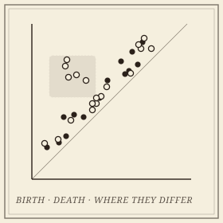

```{=html}
<header class="masthead page">
  <div class="kicker">Research &middot; Plate V</div>
  <div class="pub-title">Statistical Topology &amp; Akriti</div>
  <div class="edition">
    <span>Tests &middot; confidence sets &middot; localization &middot; software</span>
    <span>Four collaborators and a student team</span>
    <span>Updated MMXXVI</span>
  </div>
</header>

<figure class="plate-spread">
  
  <figcaption><b>Two populations of diagrams</b>&mdash;overlaid in the birth&ndash;death plane, with the one region where they genuinely differ shaded. A two-sample test says <em>whether</em>; localization says <em>where</em>.</figcaption>
</figure>

<div class="lede">
  <div class="pull-quote">
    &ldquo;A persistence diagram tells you what shape your data has. Statistics tells you whether to believe it.&rdquo;
  </div>
  <p>Topological data analysis produces summaries&mdash;persistence diagrams, Euler characteristic curves&mdash;that are routinely compared across groups of patients, materials, or simulations, and the comparisons are routinely made by eye. This project, with the statistician <a href="https://pramita-bagchi.github.io/">Pramita Bagchi</a>, builds the inferential layer the field has been missing: estimators with rates, two-sample tests with calibrated error, confidence sets, and maps of <em>where</em> in the birth&ndash;death plane two populations differ.</p>
  <p>It completes a trilogy. <a href="kernels.html">PLACE</a> gave the representation and PALACE the adaptive kernel; the inference theory makes both testable, with rates matched by minimax lower bounds. The same program reaches the Euler characteristic, where the object under test is the topological interaction of two point clouds.</p>
</div>
```

## Papers

```{=html}
<div class="section-byline">
  <span>Filed under <em>Statistics</em></span>
  <span>MMXXVI</span>
</div>
<p class="section-kicker">Whether two populations differ, where, and by how much.</p>
```

- ***[Statistical Inference for Persistence Diagrams via Landmark Embeddings: Minimax Theory and Finite Approximation](https://arxiv.org/abs/2609.07691)***&mdash;with Pramita Bagchi, Atish Mitra, and &Zcaron;iga Virk; covariance estimators, two-sample tests, and confidence balls for the landmark embeddings, with matching minimax rates and an application to resting-state brain connectivity in ABIDE.
- ***Where Do Two Populations of Persistence Diagrams Differ? Simultaneous Localization in the Birth&ndash;Death Plane***&mdash;with Pramita Bagchi, Edward Bae, Atish Mitra, Alexander D. Silberman, and &Zcaron;iga Virk; a multiplier bootstrap for simultaneous confidence intervals on local mean contrasts, turning a rejected null into a map of where the difference lives. In preparation.
- ***Statistical Inference for Topological Interaction***&mdash;with Kazuhiro Kawamura; exact tests for the intersection Euler characteristic profile, the inferential companion to the [Euler characteristic program](euler.html). In preparation.

## Akriti

```{=html}
<div class="section-byline">
  <span>Filed under <em>Software</em></span>
  <span><a href="https://akriti.io">akriti.io</a> &middot; Apache-2.0</span>
</div>
<p class="section-kicker">The statistical layer that Python's TDA stack lacks.</p>
```

The methods on this page are only as useful as the code that runs them. [*Akriti*](https://akriti.io) is an open-source Python library for statistically grounded topological data analysis: hypothesis tests, effect sizes, per-region significance, and sample-size calculation for persistence diagrams. It delegates the computation of persistence to the established engines&mdash;GUDHI and Ripser&mdash;rather than reimplementing them, and owns the inference. The first release is [on PyPI](https://pypi.org/project/akriti/); the library is in early development and says so.

It is built in the open by a student developer team in the United States and India, with a governed contribution process: onboarding documents, public design RFCs, code review, and credit. Software engineering, like proof writing, is taught by apprenticeship.

## Collaborators

```{=html}
<div class="section-byline">
  <span>Filed under <em>Co-authors</em></span>
  <span>Four institutions, three countries</span>
</div>
<p class="section-kicker">A statistician, three topologists, and students.</p>
```

- Pramita Bagchi, The George Washington University
- Atish Mitra, Montana Technological University
- &Zcaron;iga Virk, University of Ljubljana
- Kazuhiro Kawamura, University of Tsukuba
- Edward Bae and Alexander D. Silberman, student co-authors

```{=html}
<aside class="colophon" style="margin-top: 3rem;">
  <span class="monogram">&#10086;</span>
  <p>Back to the <a href="../">research overview</a>, or read about the <a href="kernels.html">certified kernels</a> these tests are built on.</p>
</aside>
```
